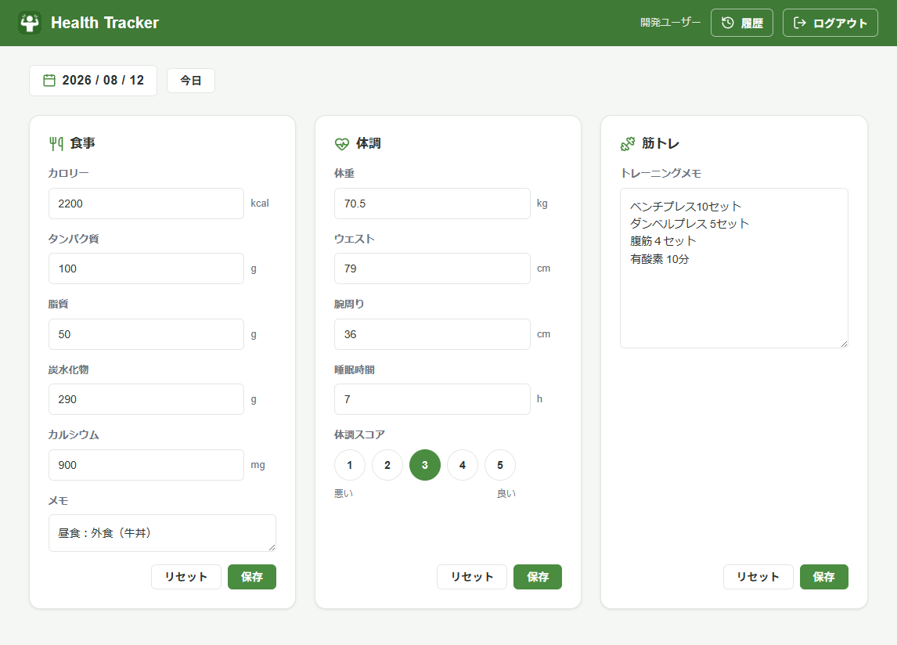
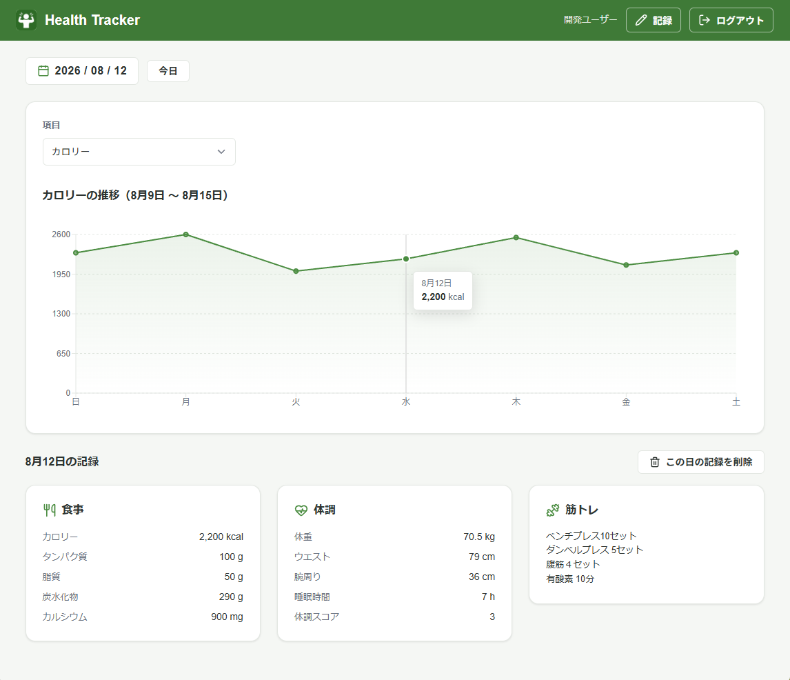

# 健康管理マスター

日ごとの食事・体調・筋トレを記録し、週単位で推移を確認する Web アプリ。





## 主な機能

| 機能 | 内容 |
|---|---|
| 日次記録 | 食事・体調・筋トレを1日1件で記録（部分入力可・同日は上書き更新） |
| 週間グラフ | カロリー・体重など10項目の推移を日曜〜土曜で表示 |
| 履歴確認 | 日付を選んで記録を表示・日次一括削除 |

## 技術スタック

| レイヤー | 技術 |
|---|---|
| Frontend | React 19 / TypeScript / Vite / React Router / Recharts |
| Backend | NestJS 11 / TypeScript / Prisma |
| DB | PostgreSQL 16 |
| 認証 | Amazon Cognito（aws-jwt-verify でトークン検証） |
| インフラ | AWS / Terraform |

## アーキテクチャ

```text
daily-health-tracker/
├── apps/
│   ├── frontend/       # React + Vite（画面・状態管理・API通信）
│   └── backend/        # NestJS API（meals / conditions / workouts / history / auth）
├── infra/terraform/    # AWS インフラ定義
├── docs/               # 設計ドキュメント
└── docker-compose.yml
```

## 設計・実装のポイント

- 記録は `userId + recordDate` で一意。未入力は `null`、`0` は有効値として区別する。
- 記録日は JST 午前5時を境界に算出する。
- 週範囲（日曜〜土曜）はバックエンドで算出し、1リクエストで7日分を返す。
- 認証は Cognito の Access Token を検証する。フロントの認証状態は画面制御のみに使う。

## 動作環境

- Node.js 20.19 以上
- Docker（PostgreSQL 用）

## セットアップ

各アプリの `.env.example` を基に `.env` を作成する（`apps/backend`・`apps/frontend`）。

```bash
# 1. PostgreSQL を起動
docker compose up -d postgres

# 2. Backend
cd apps/backend
npm install
npx prisma migrate dev
npm run start:dev

# 3. Frontend
cd apps/frontend
npm install
npm run dev
```

## ドキュメント

| 資料 | 内容 |
|---|---|
| [01-requirements](docs/01-requirements.md) | 要件定義 |
| [02-screen-design](docs/02-screen-design.md) | 画面設計 |
| [03-api-design](docs/03-api-design.md) | API 設計 |
| [04-auth-design](docs/04-auth-design.md) | 認証・認可設計 |
| [05-frontend-design](docs/05-frontend-design.md) | フロントエンド設計 |
| [06-data-items](docs/06-data-items.md) | データ項目定義 |
| [07-validation-error-design](docs/07-validation-error-design.md) | バリデーション・エラー設計 |
| [08-state-data-flow](docs/08-state-data-flow.md) | 状態管理・データフロー |
| [09-test-viewpoints](docs/09-test-viewpoints.md) | テスト観点 |
| [10-adr](docs/10-adr.md) | 設計判断記録（ADR） |
| [11-aws-architecture](docs/11-aws-architecture.md) | AWS 構成 |
| [12-operation-design](docs/12-operation-design.md) | 運用設計 |
| [13-backend-architecture](docs/13-backend-architecture.md) | バックエンド構成 |
| [14-UI-design-v2](docs/14-UI-design-v2.md) | UI 設計 v2 |
