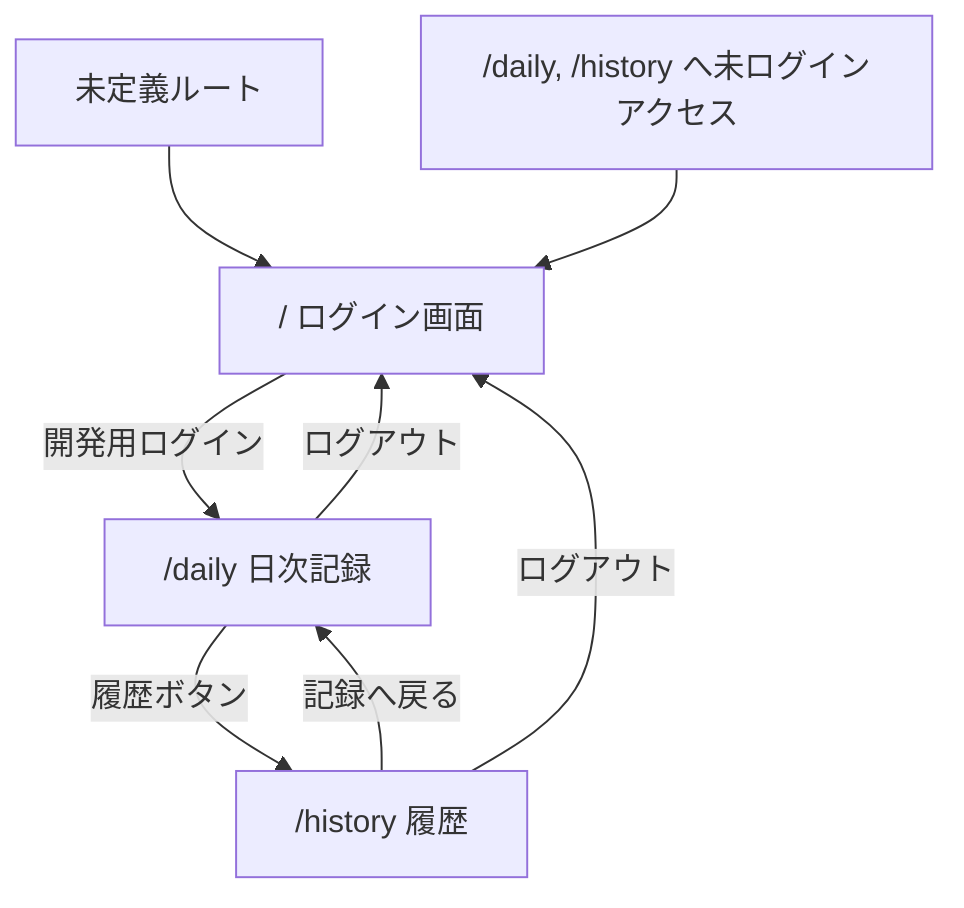

# daily-health-tracker 現状把握メモ

## 1. このドキュメントの目的

このドキュメントは、`daily-health-tracker` の既存実装を読み取り、後続の要件定義書・画面設計書・API設計書・認証・認可設計書・フロントエンド設計書などを作成するための現状棚卸しを行うものです。

この Phase 0 では正式な設計方針は決定しません。実装から確認できた内容、推測、未確認事項、今後の検討事項を分けて整理します。

補足: 現在のシェル表示では、README や一部ソースコード内の日本語コメント・UI文言が文字化けして見えました。実装構造や識別子から読み取れる範囲で整理していますが、後続資料化前に文字コードまたは表示環境の確認が必要です。

## 2. リポジトリ全体構成

主要構成は以下です。

```text
daily-health-tracker/
├─ README.md
├─ docker-compose.yml
├─ apps/
│  ├─ frontend/
│  │  ├─ package.json
│  │  ├─ vite.config.ts
│  │  ├─ index.html
│  │  ├─ public/
│  │  └─ src/
│  │     ├─ App.tsx
│  │     ├─ main.tsx
│  │     ├─ contexts/
│  │     ├─ pages/
│  │     ├─ components/
│  │     ├─ hooks/
│  │     ├─ types/
│  │     └─ utils/
│  └─ backend/
│     ├─ package.json
│     ├─ Dockerfile
│     ├─ nest-cli.json
│     ├─ eslint.config.mjs
│     ├─ prisma/
│     │  ├─ schema.prisma
│     │  ├─ seed.ts
│     │  └─ migrations/
│     ├─ src/
│     │  ├─ main.ts
│     │  ├─ app.module.ts
│     │  ├─ auth/
│     │  ├─ common/
│     │  ├─ prisma/
│     │  ├─ meals/
│     │  ├─ conditions/
│     │  ├─ workouts/
│     │  └─ history/
│     └─ test/
└─ docs/
   └─ 00-current-state-analysis.md
```

分類別に見ると以下です。

| 分類 | 主な場所 | 現状 |
| -- | -- | -- |
| フロントエンド | `apps/frontend` | React + TypeScript + Vite。画面、フォーム、hooks、API client を含む |
| バックエンド | `apps/backend` | NestJS + TypeScript。module / controller / service / DTO 構成 |
| DB / Prisma | `apps/backend/prisma` | PostgreSQL 用 Prisma schema、migration、seed |
| Docker | `docker-compose.yml`, `apps/backend/Dockerfile` | PostgreSQL と backend コンテナ。frontend はコンテナ化されていない |
| docs | `docs/` | 今回作成 |
| その他設定 | `package.json`, `tsconfig*`, `eslint.config.mjs`, `vite.config.ts` | lint / build / test 設定あり。root package は未確認または存在しない |

## 3. 技術スタック

| 分類 | 確認できた技術 |
| -- | -- |
| フロントエンド | React 19, TypeScript, Vite, React Router, react-calendar |
| バックエンド | NestJS 11, TypeScript, Express platform |
| DB | PostgreSQL 16 |
| ORM | Prisma 7, `@prisma/adapter-pg` |
| API ドキュメント | `@nestjs/swagger`, `swagger-ui-express`。`ENABLE_SWAGGER=true` の場合 `/api-docs` |
| Docker | Docker Compose, backend Dockerfile, PostgreSQL volume |
| 認証 | 現状は本格認証未実装。フロントは `login()` で `userId=1` をセットし、API client が `X-User-Id` を送信。バックエンドは `X-User-Id` を検証する仮 Guard |
| テスト | backend に Jest / Supertest 設定。初期 AppController 系テストのみ確認。frontend テストは未確認または未実装 |
| lint / format | backend: ESLint + Prettier。frontend: oxlint |
| CI/CD | `.github` ディレクトリは存在せず、現状未実装 |

README 上は Cognito が将来の認証候補として記載されていますが、実装上は Cognito 連携、JWT 検証、サインアップ、ログイン、ログアウトの本格処理は確認できません。

## 4. アプリケーション概要

実装から確認できる範囲では、このアプリは日々の健康記録を管理する個人向け Web アプリです。

主な記録対象は以下です。

- 食事記録: カロリー、たんぱく質、脂質、炭水化物、カルシウム、メモ
- 体調記録: 体重、ウエスト、腕周り、睡眠時間、体調スコア
- 筋トレ記録: トレーニングメモ
- 履歴: 月次カレンダー上の記録日表示、日次詳細表示、日次一括削除

フロントエンドでは JST 午前5時を境界として「今日の記録日」を算出する helper が存在します。

## 5. 実装済み機能一覧

| 分類 | 機能 | 実装状況 | 関連ファイル | 備考 |
| -- | -- | ---- | ------ | -- |
| 食事記録 | 日付別取得 | 実装済み | `apps/backend/src/meals/*`, `apps/frontend/src/hooks/useMeal.ts` | `GET /api/meals?date=YYYY-MM-DD` |
| 食事記録 | 作成・更新 | 実装済み | `apps/backend/src/meals/*`, `MealForm.tsx` | upsert。`userId + recordDate` で一意 |
| 体調記録 | 日付別取得 | 実装済み | `apps/backend/src/conditions/*`, `useCondition.ts` | `GET /api/conditions?date=YYYY-MM-DD` |
| 体調記録 | 作成・更新 | 実装済み | `apps/backend/src/conditions/*`, `ConditionForm.tsx` | upsert |
| 筋トレ記録 | 日付別取得 | 実装済み | `apps/backend/src/workouts/*`, `useWorkout.ts` | `GET /api/workouts?date=YYYY-MM-DD` |
| 筋トレ記録 | 作成・更新 | 実装済み | `apps/backend/src/workouts/*`, `WorkoutForm.tsx` | upsert |
| 履歴 | 月次記録日一覧 | 実装済み | `apps/backend/src/history/*`, `HistoryPage.tsx` | `GET /api/history/monthly` |
| 履歴 | 日次詳細取得 | 実装済み | `apps/backend/src/history/*`, `HistoryPage.tsx` | meal / condition / workout をまとめて返す |
| 履歴 | 日次一括削除 | 実装済み | `apps/backend/src/history/*`, `HistoryPage.tsx` | meal / condition / workout を transaction で削除 |
| 認証 | 仮ログイン | 実装済み | `AuthContext.tsx`, `LoginPage.tsx` | `login()` で `userId=1` を state にセット |
| 認証 | API 仮保護 | 実装済み | `auth.guard.ts`, `current-user.decorator.ts` | `X-User-Id` 必須。JWT 検証は未実装 |
| 認証 | 本格ログイン | 未実装 | - | サインアップ、ログイン、トークン管理、Cognito 連携は未実装 |
| 共通UI | エラー表示 | 一部実装 | `ErrorBanner.tsx`, hooks | API error message を表示 |
| API | Swagger | 一部実装 | `main.ts`, 各 controller | `ENABLE_SWAGGER=true` の場合 |
| DB | Prisma モデル | 実装済み | `schema.prisma` | User / Meal / Condition / Workout |
| Docker | backend + DB | 実装済み | `docker-compose.yml`, `Dockerfile` | frontend は Docker Compose に含まれない |

## 6. 画面一覧

| 画面名 | URL / Route | 目的 | 主な表示項目 | 主な操作 | 関連ファイル |
| --- | ----------- | -- | ------ | ---- | ------ |
| ログイン画面 | `/` | 開発用ログイン入口 | アプリ名、説明、ログインボタン | 開発用ログインボタン押下で `/daily` へ遷移 | `apps/frontend/src/pages/LoginPage.tsx` |
| 日次記録画面 | `/daily` | 指定日の食事・体調・筋トレを入力・保存 | 日付入力、ユーザーID表示、食事フォーム、体調フォーム、筋トレフォーム | 日付変更、今日へ戻る、各フォーム保存、リセット、履歴へ遷移、ログアウト | `DailyPage.tsx`, `MealForm.tsx`, `ConditionForm.tsx`, `WorkoutForm.tsx` |
| 履歴画面 | `/history` | 月次カレンダーと日次詳細確認 | カレンダー、記録あり日付のマーク、日次詳細 | 月移動、日付選択、日次削除、記録画面へ戻る、ログアウト | `HistoryPage.tsx` |
| 未定義ルート | `*` | 不明 URL の退避 | なし | `/` へリダイレクト | `App.tsx` |

認証状態がない場合、`/daily` と `/history` は `PrivateRoute` により `/` へリダイレクトされます。ただし、認証状態は React state のみで保持されるため、リロード時にはログイン状態が失われます。

## 7. 画面遷移の現状

現状の画面遷移は以下です。



実装から確認できたこと:

- `/` はログイン画面です。
- ログインボタン押下で `AuthContext.login()` が実行され、`userId=1` がセットされます。
- `/daily` と `/history` は `PrivateRoute` 配下です。
- ログアウト時は `userId=null` に戻し、`/` へ遷移します。

将来的に認証設計で検討すべき遷移:

- サインアップ画面
- 本格ログイン画面
- ログアウト後の遷移
- トークン期限切れ時の遷移
- 401 / 403 発生時の遷移
- 認証済みユーザーが `/` にアクセスした場合の扱い

## 8. API一覧

バックエンドは `app.setGlobalPrefix('api')` により API prefix が `/api` です。

| メソッド | エンドポイント | 用途 | 認証要否 | リクエスト | レスポンス | 関連ファイル |
| ---- | ------- | -- | ---- | ----- | ----- | ------ |
| GET | `/api` | Hello World | 不要 | なし | `Hello World!` | `app.controller.ts` |
| GET | `/api/health` | health check | 不要 | なし | `{ status: "ok" }` | `app.controller.ts` |
| GET | `/api/meals?date=YYYY-MM-DD` | 食事記録の日付別取得 | 現状 `X-User-Id` 必須。将来は認証必須想定 | query: `date` | `Meal` または `null` | `meals.controller.ts` |
| POST | `/api/meals` | 食事記録 upsert | 現状 `X-User-Id` 必須。将来は認証必須想定 | body: `UpsertMealDto` | `Meal` | `meals.controller.ts` |
| GET | `/api/conditions?date=YYYY-MM-DD` | 体調記録の日付別取得 | 現状 `X-User-Id` 必須。将来は認証必須想定 | query: `date` | `Condition` または `null` | `conditions.controller.ts` |
| POST | `/api/conditions` | 体調記録 upsert | 現状 `X-User-Id` 必須。将来は認証必須想定 | body: `UpsertConditionDto` | `Condition` | `conditions.controller.ts` |
| GET | `/api/workouts?date=YYYY-MM-DD` | 筋トレ記録の日付別取得 | 現状 `X-User-Id` 必須。将来は認証必須想定 | query: `date` | `Workout` または `null` | `workouts.controller.ts` |
| POST | `/api/workouts` | 筋トレ記録 upsert | 現状 `X-User-Id` 必須。将来は認証必須想定 | body: `UpsertWorkoutDto` | `Workout` | `workouts.controller.ts` |
| GET | `/api/history/monthly?year=YYYY&month=M` | 指定月に記録が存在する日付一覧 | 現状 `X-User-Id` 必須。将来は認証必須想定 | query: `year`, `month` | `string[]` | `history.controller.ts` |
| GET | `/api/history/daily?date=YYYY-MM-DD` | 指定日の食事・体調・筋トレ一括取得 | 現状 `X-User-Id` 必須。将来は認証必須想定 | query: `date` | `{ date, meal, condition, workout }` | `history.controller.ts` |
| DELETE | `/api/history/daily?date=YYYY-MM-DD` | 指定日の食事・体調・筋トレ一括削除 | 現状 `X-User-Id` 必須。将来は認証必須想定 | query: `date` | 204 No Content | `history.controller.ts` |

現状の認証要否:

- `meals`, `conditions`, `workouts`, `history` は `@UseGuards(AuthGuard)` により `X-User-Id` が必要です。
- `X-User-Id` は JWT ではなく開発用ヘッダーです。
- ヘッダーの整数チェックはありますが、DB 上にユーザーが存在するかの確認や、本人性の検証はありません。

## 9. フロントエンドとAPIの対応

| 画面 | 操作 | 呼び出すAPI | 備考 |
| -- | -- | ------- | -- |
| 日次記録 | 食事フォーム初期表示・日付変更 | `GET /api/meals?date=...` | `useMeal` |
| 日次記録 | 食事保存 | `POST /api/meals` | `MealForm` から payload 作成 |
| 日次記録 | 体調フォーム初期表示・日付変更 | `GET /api/conditions?date=...` | `useCondition` |
| 日次記録 | 体調保存 | `POST /api/conditions` | `ConditionForm` から payload 作成 |
| 日次記録 | 筋トレフォーム初期表示・日付変更 | `GET /api/workouts?date=...` | `useWorkout` |
| 日次記録 | 筋トレ保存 | `POST /api/workouts` | `WorkoutForm` から payload 作成 |
| 履歴 | 月表示 | `GET /api/history/monthly?year=...&month=...` | 記録あり日付をカレンダーにマーク |
| 履歴 | 日付クリック | `GET /api/history/daily?date=...` | 詳細パネルに表示 |
| 履歴 | 日次削除 | `DELETE /api/history/daily?date=...` | 削除後、月次一覧と日次詳細を再取得 |

API 通信層:

- `apps/frontend/src/utils/apiClient.ts`
- `createApiClient(userId)` が `fetch` をラップします。
- `Content-Type: application/json` と `X-User-Id: ${userId}` を付与します。
- `ApiError` により HTTP エラーとネットワークエラーを扱います。

## 10. DB / Prismaモデルの現状

| モデル名 | 主な項目 | 関係性 | 用途 | 備考 |
| ---- | ---- | --- | -- | -- |
| `User` | `id`, `email`, `name`, `cognitoSub`, `createdAt`, `updatedAt` | `Meal[]`, `Condition[]`, `Workout[]` | ユーザー管理 | `email` と `cognitoSub` は unique。Cognito 将来対応の余地あり |
| `Meal` | `id`, `userId`, `recordDate`, `calories`, `protein`, `fat`, `carbs`, `calcium`, `memo`, `createdAt`, `updatedAt` | `User` に属する | 食事記録 | `@@unique([userId, recordDate])` |
| `Condition` | `id`, `userId`, `recordDate`, `weight`, `waist`, `armCircumference`, `sleepHours`, `conditionScore`, `createdAt`, `updatedAt` | `User` に属する | 体調記録 | `@@unique([userId, recordDate])` |
| `Workout` | `id`, `userId`, `recordDate`, `memo`, `createdAt`, `updatedAt` | `User` に属する | 筋トレ記録 | `@@unique([userId, recordDate])` |

確認できたこと:

- `recordDate` は Prisma 上 `DateTime @db.Date` です。
- 各記録は `userId + recordDate` で1日1件に制約されています。
- `seed.ts` は `dev@example.com` のユーザーを upsert します。
- `User.cognitoSub` が nullable unique として存在し、Cognito 導入余地があります。

未確認・今後確認すべきこと:

- seed user の `id` が常に 1 であることを前提にしてよいか。
- 本格認証時に `User.id` と Cognito `sub` をどう対応させるか。
- ユーザー削除時の関連データ削除方針。現状の FK は `ON DELETE RESTRICT` です。

## 11. 認証・認可の現状

### 11.1 現状実装されていること

フロントエンド:

- `apps/frontend/src/contexts/AuthContext.tsx` に `AuthProvider` があります。
- `login()` は `setUserId(1)` を実行します。
- `logout()` は `setUserId(null)` を実行します。
- `userId !== null` のとき `createApiClient(userId)` を作成します。
- `PrivateRoute` は `isLoggedIn` が false の場合 `/` へリダイレクトします。
- `LoginPage` は開発用ログインボタンを持ち、クリックで `/daily` へ遷移します。

バックエンド:

- `apps/backend/src/auth/auth.guard.ts` に `AuthGuard` があります。
- `X-User-Id` ヘッダーがない場合は `UnauthorizedException` です。
- `X-User-Id` が整数でない場合も `UnauthorizedException` です。
- `request.userId` にヘッダー由来の整数をセットします。
- `@CurrentUserId()` decorator が `request.userId` を controller 引数へ渡します。
- 各記録系 controller は `@UseGuards(AuthGuard)` を使用しています。

DB / API:

- `User` モデルと各記録モデルの `userId` が存在します。
- 各 service は `userId` を条件に含めて `findUnique`, `upsert`, `deleteMany` を実行します。
- ただし、`X-User-Id` の本人性は検証されません。

### 11.2 未実装のこと

- サインアップ
- 本格ログイン
- 本格ログアウト
- トークン発行・更新・失効
- 認証状態の永続化
- Authorization ヘッダー
- JWT 検証
- Cognito User Pool 連携
- バックエンド側の本格認証ガード
- 権限・ロール管理
- ユーザーごとの厳密なデータ分離
- `X-User-Id` 偽装防止
- 401 / 403 の画面制御
- refresh token / access token の扱い
- セッション期限切れ時の UX

### 11.3 将来設計で検討すべきこと

- Cognito を使うか、独自認証にするか。
- Cognito を使う場合、User Pool / Managed Login / Amplify 利用有無をどうするか。
- JWT を backend でどう検証するか。
- `User.cognitoSub` と Cognito `sub` をどう紐づけるか。
- API では `userId` をリクエストから受け取らず、検証済み token から特定する方針にするか。
- frontend で認証状態を Context, 専用 store, Cognito SDK などのどこで管理するか。
- Private Route の責務をどう設計するか。
- API client が Authorization ヘッダーをどう付与するか。
- 他ユーザーのデータにアクセスできないことを service / guard / DB 制約のどこで担保するか。
- ログアウト時に local state / cache / token をどう破棄するか。
- 401 / 403 時にログイン画面へ戻すか、エラー画面を出すか。

## 12. フロントエンド構成の現状

ディレクトリ構成:

- `src/App.tsx`: route 定義と `AuthProvider`
- `src/pages`: `LoginPage`, `DailyPage`, `HistoryPage`
- `src/components`: 入力フォーム、`PrivateRoute`, `ErrorBanner`
- `src/hooks`: `useMeal`, `useCondition`, `useWorkout`, `useHistory`
- `src/contexts`: `AuthContext`
- `src/utils`: `apiClient`, `recordDate`
- `src/types`: API 型定義

ルーティング:

- `react-router-dom` を使用。
- `/`, `/daily`, `/history`, `*` が定義されています。
- `/daily` と `/history` は `PrivateRoute` で保護されています。

components:

- `MealForm`: 食事記録フォーム
- `ConditionForm`: 体調記録フォーム
- `WorkoutForm`: 筋トレ記録フォーム
- `ErrorBanner`: エラー表示
- `PrivateRoute`: 仮ログイン状態による route guard

hooks:

- 各記録種別ごとに取得・保存状態を持つ hook があります。
- `useHistory` は月次一覧、日次取得、日次削除を扱います。

API通信層:

- `createApiClient(userId)` が fetch をラップします。
- `VITE_API_BASE_URL` が未設定の場合は `http://localhost:3000` です。

型定義:

- `types/api.ts` に record 型と upsert payload 型があります。
- バックエンド DTO から自動生成されているわけではありません。

フォーム管理:

- React local state で管理しています。
- フォームライブラリは使っていません。
- 入力値は string として保持し、submit 時に `Number()` 変換しています。

状態管理:

- 認証状態は React Context。
- API 取得結果、loading、save status、error は各 hook の local state。
- React Query などのデータ取得ライブラリは未使用です。

エラー表示:

- 各 hook が error message を持ち、`ErrorBanner` で表示します。
- 履歴削除では `deleteError` を画面内に表示します。

ローディング表示:

- 各フォームに loading 表示があります。
- 履歴画面にも detail loading があります。

日付処理:

- `getTodayRecordDate()` が JST 午前5時境界で記録日を算出します。
- `parseRecordDate()` も存在しますが、現時点で主要画面からの利用は限定的または未確認です。

認証状態管理:

- 本格実装は未実装です。
- 現状は `userId=1` の仮ログインで、リロード時に消えます。

実務設計上の不足候補:

- API 型の自動生成または契約管理
- フォームバリデーションの frontend / backend 整合
- API エラー種別ごとの UI
- 認証状態永続化とトークン更新
- キャッシュ・再取得方針
- アクセシビリティとレスポンシブ詳細確認

## 13. バックエンド構成の現状

module:

- `AppModule` が `PrismaModule`, `MealsModule`, `ConditionsModule`, `WorkoutsModule`, `HistoryModule` を import します。
- `PrismaModule` は `@Global()` です。

controller:

- `AppController`: `/api`, `/api/health`
- `MealsController`: `/api/meals`
- `ConditionsController`: `/api/conditions`
- `WorkoutsController`: `/api/workouts`
- `HistoryController`: `/api/history/monthly`, `/api/history/daily`

service:

- 各記録 service が Prisma を直接呼びます。
- `toRecordDate(dateStr)` で `YYYY-MM-DDT00:00:00.000Z` の Date に変換します。
- `HistoryService` は monthly / daily / delete を担当します。

DTO:

- `UpsertMealDto`
- `UpsertConditionDto`
- `UpsertWorkoutDto`

validation:

- `main.ts` で `ValidationPipe` が global 設定されています。
- `whitelist: true`, `forbidNonWhitelisted: false`, `transform: true` です。
- DTO では `IsDateString`, `IsNumber`, `IsInt`, `Min`, `Max`, `MaxLength`, `IsOptional` などが使われています。
- query の `date` には専用 validation pipe は確認できません。
- `history/monthly` の `year`, `month` は `ParseIntPipe` のみです。

exception handling:

- `HttpExceptionFilter` が global filter として設定されています。
- エラーレスポンス形式は `{ statusCode, error, message, path, timestamp }` です。
- HttpException 以外は 500 として返し、logger に出力します。

Prismaとの接続:

- `PrismaService` が `PrismaClient` を継承します。
- `PrismaPg` adapter に `DATABASE_URL` を渡します。
- `onModuleInit` で connect、`onModuleDestroy` で disconnect します。

認証ガード:

- 現状は `X-User-Id` を読む仮 Guard です。
- Cognito / JWT / Authorization header は未実装です。

middleware / interceptor / pipe:

- global `ValidationPipe` と global exception filter は確認済み。
- 独自 middleware / interceptor は未確認または未実装です。

環境変数:

- backend: `DATABASE_URL`, `PORT`, `ENABLE_SWAGGER`, `CORS_ORIGIN`
- frontend: `VITE_API_BASE_URL`
- `.env.example` は存在します。
- `.env` も存在しますが、値の詳細はこのメモでは扱いません。

ログ:

- `bootstrap` 時に起動 URL と Swagger URL を `console.log` します。
- `HttpExceptionFilter` が予期しない例外を Nest `Logger` で記録します。
- 構造化ログやリクエストログは未確認または未実装です。

## 14. Docker / ローカル開発環境の現状

`docker-compose.yml` のサービス:

| サービス | 内容 |
| -- | -- |
| `postgres` | `postgres:16`, DB `health_tracker`, user/password `postgres` |
| `backend` | `./apps/backend` を build。port `3000:3000` |

backend コンテナ:

- `apps/backend/Dockerfile` を使用します。
- builder stage で `npm ci`, `prisma generate`, `npm run build` を実行します。
- runner stage で `npm ci --omit=dev` を実行します。
- 起動コマンドは `npx prisma migrate deploy && node dist/src/main.js` です。

DB コンテナ:

- port `5432:5432`
- volume `postgres_data:/var/lib/postgresql/data`
- `pg_isready -U postgres` の healthcheck があります。

frontend:

- Docker Compose には含まれていません。
- README 上は `apps/frontend` で `npm run dev` を実行するローカル起動前提です。

volume:

- `postgres_data`

port:

- PostgreSQL: 5432
- backend: 3000
- frontend: Vite デフォルト 5173 想定。CORS では 5173 と 5174 が許可されています。

env:

- docker-compose の backend に `DATABASE_URL`, `PORT`, `ENABLE_SWAGGER`, `CORS_ORIGIN` が定義されています。
- ローカル用 `.env.example` もあります。

現状の制約:

- frontend の本番配信・コンテナ化は未実装です。
- backend 起動時に migrate deploy するため、AWS 化時にはマイグレーション実行責務を再検討する必要があります。
- secrets は compose に平文で書かれています。ローカル開発としては単純で扱いやすい一方、本番では Secrets Manager 等が必要です。

## 15. テストの現状

フロントエンドのテスト:

- `apps/frontend/package.json` に test script は確認できません。
- `rg --files -g '*test*' -g '*spec*'` では frontend のテストファイルは見つかりませんでした。

バックエンドのテスト:

- `apps/backend/src/app.controller.spec.ts`
- `apps/backend/test/app.e2e-spec.ts`
- `package.json` に `test`, `test:watch`, `test:cov`, `test:e2e` があります。
- 現状のテストは AppController の Hello World に近い内容です。

E2Eテスト:

- NestJS 初期構成に近い e2e test が存在します。
- 食事・体調・筋トレ・履歴 API の E2E は未確認または未実装です。

テストコマンド:

- backend: `npm run test`
- backend: `npm run test:e2e`
- backend: `npm run test:cov`
- frontend: test script 未確認

今後テスト観点表で扱うべき対象:

- DTO validation
- `X-User-Id` 仮認証と将来の認証 guard
- userId ごとのデータ分離
- `userId + recordDate` の upsert
- JST 午前5時境界
- 月次履歴の日付抽出
- 日次一括削除
- 401 / 403 / 400 / 500 のエラー表示
- frontend フォーム入力・保存・リセット
- 履歴カレンダー表示・削除確認ダイアログ

## 16. CI/CDの現状

### 16.1 現状

- `.github` ディレクトリは存在しません。
- `.github/workflows` も確認できません。
- 現状 CI/CD は未実装です。

### 16.2 今後の運用設計メモで検討すべきこと

- GitHub Actions の導入
- pull request 時の backend lint / test / build
- pull request 時の frontend lint / build / 将来 test
- main merge 時の AWS デプロイ
- AWS デプロイ方式
- 環境変数・secrets 管理
- DB マイグレーション実行タイミング
- `prisma migrate deploy` の実行責務
- ロールバック方針
- デプロイ失敗時の通知
- テスト DB の扱い
- preview 環境の要否

## 17. AWS化を見据えた現状メモ

この Phase では AWS 構成は決定しません。後続の `11-aws-architecture.md` に向けた論点として整理します。

| 観点 | 現状から見える検討事項 |
| -- | -- |
| フロントエンド配置先 | Vite build 成果物を S3 + CloudFront に置くか、Amplify Hosting 等を使うか |
| バックエンド配置先 | NestJS API を ECS Fargate, App Runner, Lambda 等のどこに載せるか |
| DB | PostgreSQL を RDS / Aurora / Supabase 等にするか。現状は PostgreSQL 16 |
| 認証 | Cognito User Pool を使うか。`User.cognitoSub` は導入余地あり |
| 環境変数 | `DATABASE_URL`, `CORS_ORIGIN`, `ENABLE_SWAGGER` などの環境別管理 |
| シークレット管理 | DB password, Cognito 設定, token 検証設定を Secrets Manager / Parameter Store に置くか |
| ログ | CloudWatch Logs への出力形式、リクエストログ、エラーログ |
| 監視 | health check, API error rate, latency, DB metrics |
| CI/CD | GitHub Actions から AWS へ deploy するか |
| DBマイグレーション | デプロイ pipeline 内か、backend 起動時か、手動承認付きか |
| CORS | 本番 frontend domain を許可する設計 |
| Swagger | 本番で `/api-docs` を有効にするか |
| コスト | 個人開発として ECS/RDS/CloudFront/Cognito の固定費をどう抑えるか |

## 18. 実務設計として不足している可能性がある観点

個人開発として妥当な簡略化:

- 認証を `userId=1` の仮実装にして、先に主要機能を動かしていること
- フォーム管理を local state で実装していること
- backend と DB を Docker Compose に寄せ、frontend はローカル dev server にしていること
- 最小限の AppController テストから開始していること

実務化・AWS化に向けて補うべき観点:

- 認証・認可の本格設計
- Cognito 採用可否
- API で userId をヘッダーから受け取らない設計
- 入力バリデーションの frontend / backend 整合
- query parameter の validation
- API エラーレスポンス形式の確定
- 401 / 403 の画面制御
- 日付境界、タイムゾーン、DB date 型の扱い
- 1日1件制約の仕様化
- 削除の確認・取り消し不可の明記
- テスト戦略
- CI/CD
- ログ・監視
- secrets 管理
- DB backup / restore
- マイグレーション運用
- AWS コスト管理
- README や画面文言の文字化け確認

## 19. 後続資料への引き継ぎ事項

| 後続資料 | このPhaseで判明した引き継ぎ事項 |
| -------------- | ------------------ |
| 要件定義書 | 食事・体調・筋トレを日次で記録し、履歴確認・削除するアプリ。1日1件制約、JST 5時境界、削除仕様、対象ユーザーを確認する |
| 画面設計書 | `/`, `/daily`, `/history` の3画面。ログインは開発用と本格認証画面を分けて設計する |
| API設計書 | meals / conditions / workouts / history の REST API が実装済み。認証後は userId を token 由来に変更する前提で再設計する |
| 認証・認可設計書 | 現状は `userId=1` と `X-User-Id` の仮実装。Cognito, JWT 検証, token 保持, userId 特定, 401/403 を設計する |
| フロントエンド設計書 | React Router, Context, hooks, API client, local state 構成。認証状態管理と API エラー処理を本格化する |
| データ項目定義書 | User / Meal / Condition / Workout の項目を Prisma schema から整理する |
| バリデーション・エラー設計書 | DTO validation は一部あり。query validation、frontend validation、エラーコード・メッセージを整理する |
| 状態管理・データフロー設計書 | AuthContext、各 hook の取得・保存 state、履歴再取得、JST 5時境界を扱う |
| テスト観点表 | 現行 API、フォーム、履歴、削除、認証、日付境界、userId 分離をテスト観点化する |
| ADR | Cognito 採用、AWS 構成、backend 配置先、DB マイグレーション運用、frontend 状態管理方針を候補にする |
| AWS構成メモ | frontend 配置、backend 実行基盤、RDS、Cognito、Secrets Manager、CloudWatch、CI/CD を検討する |
| 運用設計メモ | CI/CD 未実装。GitHub Actions、secrets、deploy、rollback、migration、backup、監視通知を扱う |

## 20. 確認事項

アプリ目的・利用者:

- アプリの正式名称と正式な目的は何か。
- 想定ユーザーは本人のみか、複数ユーザー利用を前提にするか。
- 家族・トレーナー等の共有や閲覧権限は必要か。

記録仕様:

- 食事・体調・筋トレはそれぞれ 1日1件で確定か。
- 1日複数食、複数トレーニング種目を構造化する予定はあるか。
- 体調スコア 1〜5 のラベル定義は何か。
- 入力項目の必須 / 任意をどうするか。
- 数値項目の単位、小数桁、上限値をどうするか。
- メモの最大文字数は現状値でよいか。

日付・履歴:

- JST 午前5時切替を正式仕様にするか。
- 海外タイムゾーン利用は想定するか。
- DB 上の `recordDate` を UTC 00:00 として扱う現在の方針で問題ないか。
- 履歴の表示範囲、月移動、未来日入力可否をどうするか。

削除:

- 日次削除は食事・体調・筋トレを一括削除でよいか。
- 個別削除は必要か。
- 削除の取り消し、論理削除、監査ログは必要か。

認証・認可:

- Cognito を使うか。
- メールアドレス / Google など、どのログイン方式を使うか。
- User Pool Managed Login を使うか、自前 UI を作るか。
- backend で JWT を検証する方針でよいか。
- `User.cognitoSub` を Cognito の `sub` と紐づける設計でよいか。
- 初回ログイン時の User レコード作成タイミングをどうするか。
- ユーザー削除時の記録データをどう扱うか。

AWS:

- frontend は S3 + CloudFront, Amplify Hosting, その他のどれを想定するか。
- backend は ECS Fargate, App Runner, Lambda, EC2 のどれを検討するか。
- DB は RDS PostgreSQL を使うか。
- 個人開発として許容できる月額コストはどの程度か。
- Swagger を本番で公開するか。

CI/CD・運用:

- GitHub Actions を使うか。
- PR 時に lint / test / build を必須にするか。
- main merge で自動デプロイするか、手動承認を挟むか。
- DB マイグレーションを pipeline に含めるか。
- ロールバック方針をどうするか。
- 監視・通知先をどうするか。

品質:

- frontend テストを導入するか。
- API E2E テスト用 DB をどう用意するか。
- README や画面文言の文字化けを修正対象にするか。

## 21. Codexからの総評

現状の実装は、設計資料化しやすい構成です。フロントエンドは pages / components / hooks / API client に分かれており、バックエンドも NestJS の module / controller / service / DTO / Prisma 構成が明確です。DB モデルも `User` と日次記録3種に絞られているため、後続の要件定義書・画面設計書・API設計書へ展開しやすい状態です。

次に作るべき資料は要件定義書です。特に、1日1件の扱い、JST 午前5時切替、入力項目の必須/任意、履歴表示、削除仕様、認証方式の方向性を要件として整理すると、後続の画面・API・DB・テスト設計が安定します。

要件定義書作成前に確認した方がよいことは、アプリの正式な利用シナリオ、想定ユーザー、本格認証に Cognito を使うか、AWS 化時の費用感、CI/CD の自動化範囲です。

設計学習として特に注目すべきポイントは、仮認証から本格認証へ移行するときの責務分離です。現状は `AuthContext`、`apiClient`、`AuthGuard`、`CurrentUserId`、Prisma の `userId` 条件がすでに差し込み点になっているため、Cognito / JWT / userId 解決 / データ分離を段階的に設計しやすい構造です。
