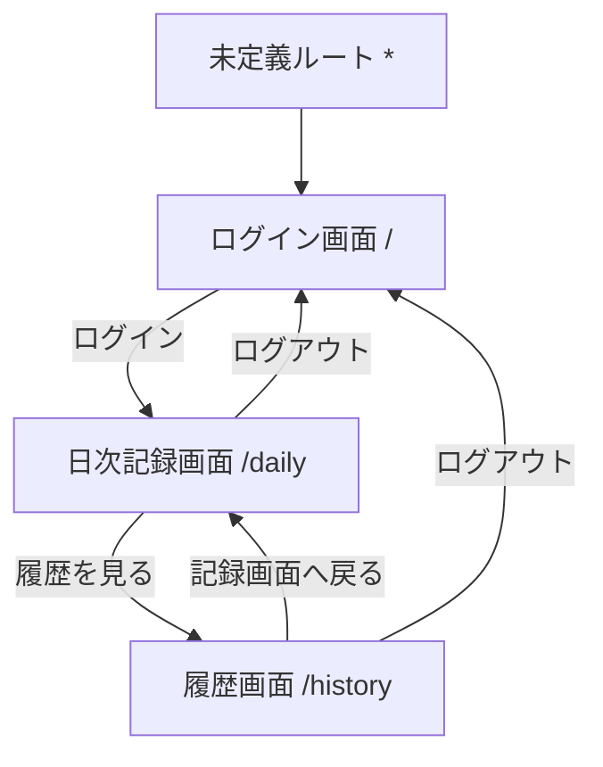
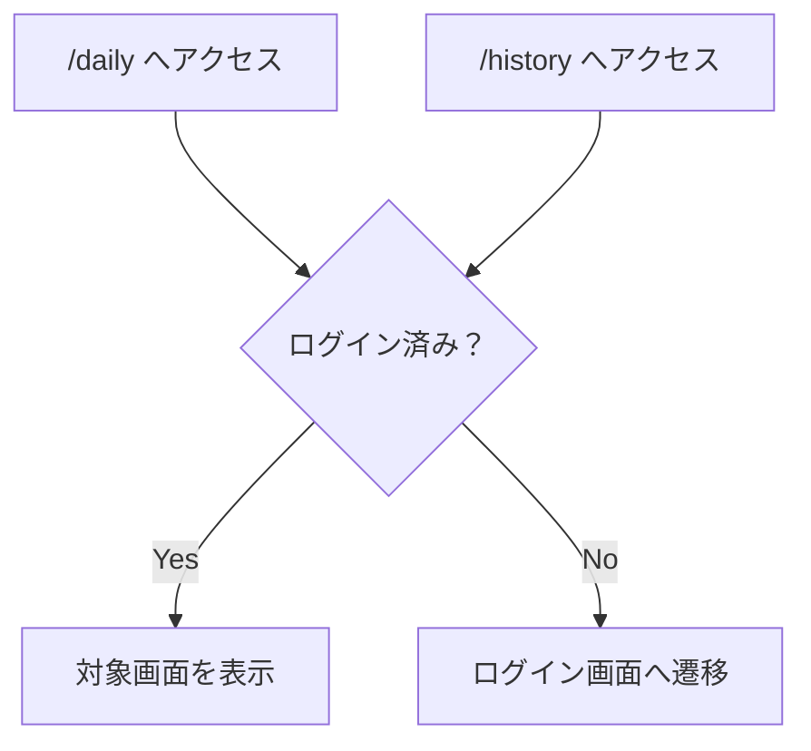

# 健康管理マスター 画面設計書案 v0.1

## 1. ドキュメントの目的

本ドキュメントは、健康管理マスターの画面仕様を整理するための画面設計書である。

要件定義書で定義した内容をもとに、利用者が操作する画面、画面ごとの目的、表示項目、入力項目、操作、画面遷移、エラー表示を整理する。

APIの詳細なリクエスト・レスポンス、認証方式、状態管理の実装方針は本ドキュメントでは詳細化しない。
それぞれ以下の後続資料で扱う。

| 項目            | 扱う資料           |
| ------------- | -------------- |
| API詳細         | API設計書         |
| 認証・認可詳細       | 認証・認可設計書       |
| 状態管理・データフロー   | 状態管理・データフロー設計書 |
| フロントエンド実装方針   | フロントエンド設計書     |
| バリデーション・エラー詳細 | バリデーション・エラー設計書 |

---

## 2. 画面設計の前提

本画面設計では、以下を前提とする。

* 初期リリースでは本人利用のみを想定する
* 食事記録、体調記録、筋トレ記録はそれぞれ1日1件とする
* 同じ日の記録を保存した場合は新規追加ではなく更新する
* 記録日はJST午前5時を境界として扱う
* 削除は日次一括削除のみとする
* 筋トレ記録は当面、自由テキストで扱う
* 現状のログインは仮実装である
* 本格認証の詳細は認証・認可設計書で扱う

---

## 3. 画面一覧

| 画面ID    | 画面名    | Route      | 目的                    | 認証要否 |
| ------- | ------ | ---------- | --------------------- | ---- |
| SCR-001 | ログイン画面 | `/`        | アプリ利用開始の入口            | 不要   |
| SCR-002 | 日次記録画面 | `/daily`   | 指定日の食事・体調・筋トレを入力・保存する | 必要   |
| SCR-003 | 履歴画面   | `/history` | 月次カレンダーと日次詳細を確認する     | 必要   |
| SCR-004 | 未定義ルート | `*`        | 不正なURLからログイン画面へ戻す     | 不要   |

---

## 4. 画面遷移

## 4.1 基本遷移

## 4.2 未ログイン時の遷移

## 4.3 本格認証導入後の扱い

本格認証導入後の以下の挙動は、認証・認可設計書で扱う。

* ログイン状態の永続化
* 認証済みユーザーが `/` にアクセスした場合の遷移
* トークン期限切れ時の遷移
* 401発生時の遷移
* 403発生時の表示
* ログアウト後の状態破棄

---

## 5. 共通画面仕様

## 5.1 共通ヘッダー

日次記録画面と履歴画面では、共通して以下の情報・操作を表示する。

| 項目      | 内容             |
| ------- | -------------- |
| アプリ名    | 健康管理マスター       |
| 現在の画面名  | 日次記録 / 履歴      |
| ログアウト操作 | ログアウトボタン       |
| 画面遷移操作  | 日次記録画面と履歴画面の移動 |

現状ではログイン中ユーザーIDを表示しているが、本格認証導入後の表示内容は認証・認可設計書で扱う。

## 5.2 共通エラー表示

画面内でエラーが発生した場合、利用者が認識できる位置にエラーメッセージを表示する。

対象となるエラーは以下。

* 入力エラー
* API通信エラー
* 保存失敗
* 取得失敗
* 削除失敗
* 認証エラー

エラー文言、エラーコード、画面ごとの詳細な表示方針はバリデーション・エラー設計書で扱う。

## 5.3 共通ローディング表示

API通信中は、利用者が処理中であることを認識できる表示を行う。

対象となる処理は以下。

* 記録取得中
* 保存中
* 履歴取得中
* 日次詳細取得中
* 削除中

ローディングUIの詳細はフロントエンド設計書で扱う。

---

## 6. SCR-001 ログイン画面

## 6.1 画面目的

利用者がアプリの利用を開始するための入口画面である。

現状は開発用ログインとして、ログインボタン押下により仮ログイン状態となり、日次記録画面へ遷移する。

本格認証導入後のログイン方式、入力項目、認証フローは認証・認可設計書で扱う。

## 6.2 表示項目

| 項目      | 内容                         | 備考         |
| ------- | -------------------------- | ---------- |
| アプリ名    | 健康管理マスター                   |            |
| アプリ説明   | 日ごとの食事・体調・筋トレ記録を管理するWebアプリ |            |
| ログインボタン | アプリへログインする                 | 現状は開発用ログイン |

## 6.3 入力項目

現状の仮ログインでは、入力項目は持たない。

本格認証導入後のメールアドレス、パスワード、外部認証などの入力項目は、認証・認可設計書で扱う。

## 6.4 操作

| 操作        | 挙動                    |
| --------- | --------------------- |
| ログインボタン押下 | 仮ログイン状態にし、日次記録画面へ遷移する |

## 6.5 遷移

| 遷移条件              | 遷移先      |
| ----------------- | -------- |
| ログイン成功            | `/daily` |
| 未定義ルートからのリダイレクト   | `/`      |
| 未ログイン状態で保護画面へアクセス | `/`      |

## 6.6 エラー表示

現状の仮ログインでは、ログイン失敗エラーは想定しない。

本格認証導入後は、以下のエラー表示を検討する。

* メールアドレスまたはパスワード不正
* 認証失敗
* アカウント未確認
* 通信エラー
* セッション期限切れ

詳細は認証・認可設計書およびバリデーション・エラー設計書で扱う。

---

## 7. SCR-002 日次記録画面

## 7.1 画面目的

指定した記録日に対して、食事・体調・筋トレの記録を入力・保存する画面である。

食事記録、体調記録、筋トレ記録はそれぞれ1日1件とする。
同じ日付で再保存した場合は、既存記録を更新する。

## 7.2 表示項目

| 項目        | 内容            | 備考            |
| --------- | ------------- | ------------- |
| 画面タイトル    | 日次記録          |               |
| 記録日       | 現在選択中の記録日     | JST午前5時境界に基づく |
| 食事記録フォーム  | 食事記録を入力・保存する  |               |
| 体調記録フォーム  | 体調記録を入力・保存する  |               |
| 筋トレ記録フォーム | 筋トレ記録を入力・保存する | 自由テキスト        |
| 履歴画面への導線  | 履歴画面へ遷移する     |               |
| ログアウトボタン  | ログアウトする       |               |

## 7.3 入力項目

## 7.3.1 記録日

| 項目    | 内容            | 備考         |
| ----- | ------------- | ---------- |
| 記録日   | 入力・表示対象の日付    | 初期値は当日の記録日 |
| 今日へ戻る | 記録日を当日の記録日に戻す | JST午前5時境界  |

未来日の入力可否、過去日の編集制限は今後確認する。

## 7.3.2 食事記録

| 項目    | 内容       | 備考                  |
| ----- | -------- | ------------------- |
| カロリー  | 食事の総カロリー | 単位・入力制約はデータ項目定義書で扱う |
| たんぱく質 | P        | 単位・入力制約はデータ項目定義書で扱う |
| 脂質    | F        | 単位・入力制約はデータ項目定義書で扱う |
| 炭水化物  | C        | 単位・入力制約はデータ項目定義書で扱う |
| カルシウム | Ca       | 単位・入力制約はデータ項目定義書で扱う |
| メモ    | 食事内容のメモ  | 最大文字数はデータ項目定義書で扱う   |

各項目の必須/任意、数値範囲、桁数はデータ項目定義書およびバリデーション・エラー設計書で扱う。

## 7.3.3 体調記録

| 項目    | 内容       | 備考                  |
| ----- | -------- | ------------------- |
| 体重    | その日の体重   | 単位・入力制約はデータ項目定義書で扱う |
| ウエスト  | 腹囲・ウエスト  | 単位・入力制約はデータ項目定義書で扱う |
| 腕周り   | 腕周り      | 単位・入力制約はデータ項目定義書で扱う |
| 睡眠時間  | 睡眠時間     | 単位・入力制約はデータ項目定義書で扱う |
| 体調スコア | 1〜5の体調評価 | ラベル定義は今後確認する        |

各項目の必須/任意、数値範囲、桁数はデータ項目定義書およびバリデーション・エラー設計書で扱う。

## 7.3.4 筋トレ記録

| 項目    | 内容        | 備考        |
| ----- | --------- | --------- |
| 筋トレメモ | その日の筋トレ内容 | 当面は自由テキスト |

トレーニング種目、セット数、重量、回数の構造化管理は今回対象外とする。

## 7.4 操作

| 操作        | 挙動                        |
| --------- | ------------------------- |
| 記録日変更     | 指定した日付の食事・体調・筋トレ記録を取得する   |
| 今日へ戻る     | 記録日を当日の記録日に戻し、対象日の記録を取得する |
| 食事記録保存    | 対象日の食事記録を登録または更新する        |
| 体調記録保存    | 対象日の体調記録を登録または更新する        |
| 筋トレ記録保存   | 対象日の筋トレ記録を登録または更新する       |
| 各フォームリセット | 入力中の内容をリセットする             |
| 履歴を見る     | 履歴画面へ遷移する                 |
| ログアウト     | ログアウトし、ログイン画面へ遷移する        |

## 7.5 API連携

| 操作      | API分類    | 備考              |
| ------- | -------- | --------------- |
| 食事記録取得  | 食事記録API  | API詳細はAPI設計書で扱う |
| 食事記録保存  | 食事記録API  | 登録・更新           |
| 体調記録取得  | 体調記録API  | API詳細はAPI設計書で扱う |
| 体調記録保存  | 体調記録API  | 登録・更新           |
| 筋トレ記録取得 | 筋トレ記録API | API詳細はAPI設計書で扱う |
| 筋トレ記録保存 | 筋トレ記録API | 登録・更新           |

## 7.6 ローディング表示

以下のタイミングでローディング表示を行う。

* 記録取得中
* 食事記録保存中
* 体調記録保存中
* 筋トレ記録保存中

## 7.7 エラー表示

以下のエラーを画面内で表示する。

* 記録取得失敗
* 保存失敗
* 入力値不正
* 通信エラー
* 認証エラー

エラーメッセージの具体文言は、バリデーション・エラー設計書で扱う。

## 7.8 空データ時の表示

指定日の記録が存在しない場合は、空の入力フォームを表示する。

この場合、保存操作により新規登録として扱う。

## 7.9 補足・未確定事項

* 未来日の入力を許可するか
* 過去日の編集範囲に制限を設けるか
* 各入力項目の必須/任意
* 体調スコア1〜5の意味
* 保存成功時の表示をどうするか

---

## 8. SCR-003 履歴画面

## 8.1 画面目的

月次カレンダーで記録がある日付を確認し、選択した日付の日次記録を確認する画面である。

必要に応じて、選択した日付の食事・体調・筋トレ記録を一括削除できる。

## 8.2 表示項目

| 項目         | 内容            | 備考            |
| ---------- | ------------- | ------------- |
| 画面タイトル     | 履歴            |               |
| 月次カレンダー    | 対象月の日付一覧      | 記録がある日付を識別できる |
| 選択中の日付     | 現在詳細表示している日付  |               |
| 食事記録詳細     | 選択日の食事記録      | 記録がある場合       |
| 体調記録詳細     | 選択日の体調記録      | 記録がある場合       |
| 筋トレ記録詳細    | 選択日の筋トレ記録     | 記録がある場合       |
| 日次削除ボタン    | 選択日の記録を一括削除する | 確認後に削除        |
| 記録画面へ戻るボタン | 日次記録画面へ戻る     |               |
| ログアウトボタン   | ログアウトする       |               |

## 8.3 操作

| 操作      | 挙動                        |
| ------- | ------------------------- |
| 月移動     | 対象月の記録あり日付を取得し、カレンダーを更新する |
| 日付選択    | 選択した日付の日次詳細を取得して表示する      |
| 日次削除    | 選択日の食事・体調・筋トレ記録を一括削除する    |
| 記録画面へ戻る | 日次記録画面へ遷移する               |
| ログアウト   | ログアウトし、ログイン画面へ遷移する        |

## 8.4 API連携

| 操作        | API分類 | 備考                 |
| --------- | ----- | ------------------ |
| 月次カレンダー表示 | 履歴API | 対象月の記録あり日付を取得      |
| 日付選択      | 履歴API | 選択日の食事・体調・筋トレ記録を取得 |
| 日次削除      | 履歴API | 選択日の記録を一括削除        |

APIの詳細なエンドポイント、リクエスト、レスポンス、ステータスコードはAPI設計書で扱う。

## 8.5 ローディング表示

以下のタイミングでローディング表示を行う。

* 月次履歴取得中
* 日次詳細取得中
* 日次削除中

## 8.6 エラー表示

以下のエラーを画面内で表示する。

* 月次履歴取得失敗
* 日次詳細取得失敗
* 日次削除失敗
* 通信エラー
* 認証エラー

エラーメッセージの具体文言は、バリデーション・エラー設計書で扱う。

## 8.7 空データ時の表示

記録がない日付を選択した場合は、記録が存在しないことを表示する。

例：

* 食事記録はありません
* 体調記録はありません
* 筋トレ記録はありません

表示文言は後続のバリデーション・エラー設計書または画面文言整理で調整する。

## 8.8 削除確認

日次削除を行う前に、利用者へ確認を表示する。

削除対象は以下とする。

* 選択日の食事記録
* 選択日の体調記録
* 選択日の筋トレ記録

削除は一括削除のみとする。
個別削除、削除取り消し、論理削除は今回対象外とする。

## 8.9 補足・未確定事項

* 記録がない日付をクリックできるか
* 初期表示時にどの日付を選択状態にするか
* 削除成功後に選択日を維持するか、未選択状態に戻すか
* 削除成功後の表示メッセージをどうするか

---

## 9. SCR-004 未定義ルート

## 9.1 画面目的

定義されていないURLへアクセスした場合に、利用者をログイン画面へ戻す。

## 9.2 挙動

| 条件          | 挙動              |
| ----------- | --------------- |
| 未定義URLへアクセス | ログイン画面へリダイレクトする |

本格運用時に404画面を用意するかどうかは、フロントエンド設計書または画面設計の追加検討で扱う。

---

## 10. 画面別の状態整理

| 画面     | 主な状態                         | 備考                       |
| ------ | ---------------------------- | ------------------------ |
| ログイン画面 | ログイン処理中、ログインエラー              | 現状は仮ログインのため簡略            |
| 日次記録画面 | 選択中の記録日、各フォーム入力値、取得中、保存中、エラー | 状態管理詳細は状態管理・データフロー設計書で扱う |
| 履歴画面   | 表示月、選択日、月次履歴、日次詳細、削除中、エラー    | 状態管理詳細は状態管理・データフロー設計書で扱う |

---

## 11. 画面別のAPI連携整理

| 画面     | API分類    | 用途          |
| ------ | -------- | ----------- |
| 日次記録画面 | 食事記録API  | 食事記録の取得・保存  |
| 日次記録画面 | 体調記録API  | 体調記録の取得・保存  |
| 日次記録画面 | 筋トレ記録API | 筋トレ記録の取得・保存 |
| 履歴画面   | 履歴API    | 月次履歴取得      |
| 履歴画面   | 履歴API    | 日次詳細取得      |
| 履歴画面   | 履歴API    | 日次一括削除      |

APIの詳細仕様はAPI設計書で扱う。

---

## 12. 確認事項

画面設計として、今後確認する事項は以下とする。

## 12.1 日次記録画面

* 未来日の入力を許可するか
* 過去日の編集範囲に制限を設けるか
* 食事記録の各項目を必須にするか
* 体調記録の各項目を必須にするか
* 筋トレメモを必須にするか
* 体調スコア1〜5の表示ラベルを定義するか
* 保存成功時にメッセージを表示するか

## 12.2 履歴画面

* 初期表示時に当日を選択状態にするか
* 記録がない日付をクリック可能にするか
* 削除成功後の表示状態をどうするか
* 削除成功時にメッセージを表示するか

## 12.3 共通

* 404専用画面を用意するか
* 認証エラー時にどのような画面遷移にするか
* 画面文言をどこまで統一するか
* レスポンシブ対応をどこまで考慮するか
* アクセシビリティ対応をどこまで考慮するか
