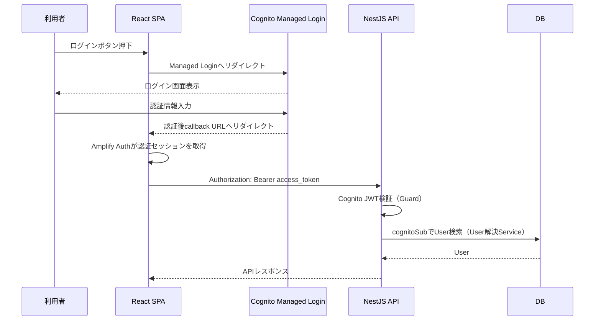
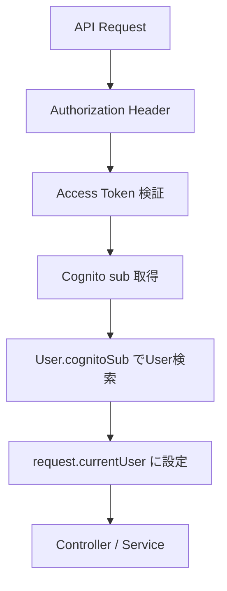
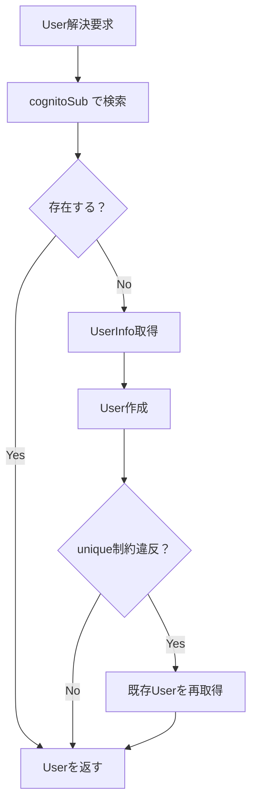
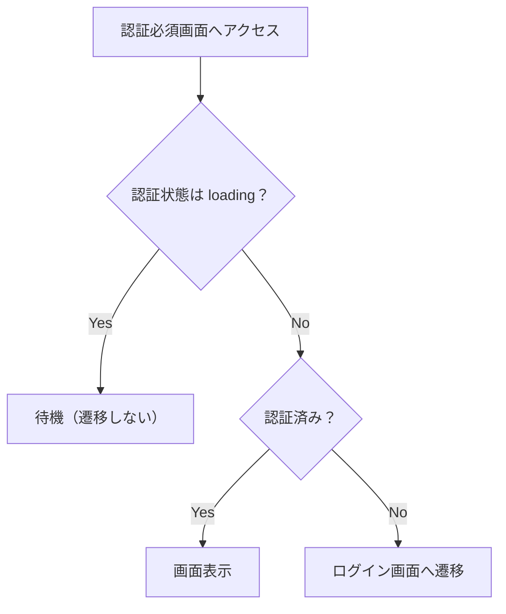
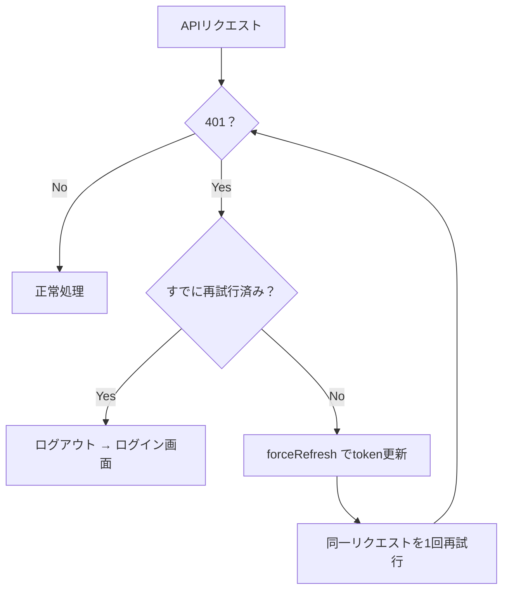

# 健康管理マスター 認証・認可設計書 v0.3

## 1. ドキュメントの目的

本ドキュメントは、健康管理マスターにおける認証・認可の設計方針を整理するための資料である。

本ドキュメントでは、以下を定義する。

* 採用する認証基盤
* ログイン・ログアウト方式
* 認証フロー
* API保護方針
* ユーザー識別方針
* ユーザーごとのデータ分離方針
* 認証エラー・認可エラー時の扱い
* フロントエンドとバックエンドの責務分担
* 初期実装で扱う範囲
* 将来課題

認証画面の細かいUI、APIの詳細仕様、状態管理の実装詳細は、本ドキュメントでは深掘りしない。
それぞれ以下の設計書で扱う。

| 項目              | 扱う資料           |
| --------------- | -------------- |
| 認証画面・画面遷移       | 画面設計書          |
| API仕様           | API設計書         |
| フロントエンド実装方針     | フロントエンド設計書     |
| 認証状態・取得データの管理   | 状態管理・データフロー設計書 |
| エラー文言・表示        | バリデーション・エラー設計書 |
| AWS設定・Cognito設定 | AWS構成メモ        |
| 設計判断の理由         | ADR / 設計判断メモ   |

## 1.1 用語

本書では、Cognitoが提供するホスト型ログイン画面を **Cognito Managed Login（旧Hosted UI）** と表記する。

以降、本書では「Managed Login」に統一する。

```text
Cognito Managed Login（旧Hosted UI）
```

AWS側では、新しいホスト型UIが Managed Login として提供されており、本プロジェクトのTerraformでも Managed Login（`managed_login_version = 2`）として構築している。

OAuth 2.0 / OIDC のエンドポイント（`/oauth2/authorize`、`/oauth2/token`、`/oauth2/userInfo`）は旧Hosted UIと共通であり、フロントエンドの実装方式は変わらない。

---

## 2. 認証・認可設計の基本方針

健康管理マスターでは、利用者本人のみが自分の健康記録を管理できることを基本方針とする。

完成形では、以下を満たす。

* 認証済みユーザーのみが記録系画面を利用できる
* 認証済みユーザーのみが記録系APIを利用できる
* ユーザーは自分の記録のみ取得・登録・更新・削除できる
* APIリクエストで任意の `userId` を指定させない
* バックエンド側で認証済みユーザーを特定する
* バックエンド側で必ずユーザー単位のデータ制御を行う
* 認証は自作せず、Cognitoに委ねる

---

## 3. 採用する認証基盤

認証基盤には **Amazon Cognito User Pool** を利用する。

Cognito User Pool を利用する目的は以下である。

* パスワード管理をアプリケーション側で直接持たない
* サインイン・サインアウト・パスワードリセット等の認証機能をCognitoに委ねる
* OAuth / OIDC に沿った認証フローを利用する
* Cognitoが発行するJWTを使ってAPIを保護する
* 将来的にGoogleログインなどの外部IDプロバイダー連携に拡張しやすくする
* AWS構成との親和性を高める

---

## 4. 採用するログイン方式

## 4.1 基本方針

ログイン方式は **Cognito Managed Login（旧Hosted UI）** を採用する。

アプリケーション側では、メールアドレス・パスワード入力画面を自作しない。

```text
採用する方式:
React SPA → Cognito Managed Login → React SPAへ戻る
```

理由：

* 素早く認証機能を完成させられる
* パスワード入力画面・パスワードリセット等を自作しなくてよい
* 認証の責務をCognitoへ寄せられる
* 独自認証実装によるセキュリティリスクを避けやすい
* 今回の目的であるアプリ本体の設計・実装学習に集中できる

## 4.2 採用しない方式

初期実装では、以下は採用しない。

| 方式                    | 採用しない理由                                        |
| --------------------- | ---------------------------------------------- |
| 独自ログイン画面 + Cognito    | Managed Loginより実装範囲が増えるため、今回は採用しない             |
| 完全独自JWT認証             | パスワード管理・refresh token管理・失効管理等の責務が重いため、今回は採用しない |
| BFF + HttpOnly Cookie | セキュリティ上は有力だが、初期実装としては構成が重いため、将来課題とする           |

---

## 5. OAuth / OIDC フロー

## 5.1 採用フロー

Cognito Managed Login では、以下のフローを利用する。

```text
Authorization Code Grant + PKCE
```

SPAはブラウザ上で動作するpublic clientであり、client secretを安全に保持できない。
そのため、Cognito App Clientでは **client secretを利用しない**。

PKCEはpublic client向けのAuthorization Code Grant拡張であり、認可コード横取りリスクを下げるために利用する。

## 5.2 認証フロー概要



---

## 6. フロントエンド認証ライブラリ

## 6.1 採用ライブラリ

フロントエンドでは **Amplify Auth v6**（`aws-amplify` パッケージの `aws-amplify/auth`）を利用する。

Amplify Auth の役割は以下である。

* Cognito Managed Loginへのリダイレクト
* Managed Loginから戻った後の認証コード交換とセッション確立
* 認証状態の取得
* 認証済みユーザー情報の取得
* access token / ID token の取得
* token更新（refresh）
* サインアウト処理

PKCEのcode_verifier生成・保持・検証はAmplify Auth側が担う。アプリケーション側でPKCEを自作しない。

## 6.2 ログイン開始

ログインボタン押下時は、Amplify AuthからCognito Managed Loginへリダイレクトする。

実装イメージ：

```ts
import { signInWithRedirect } from 'aws-amplify/auth';

await signInWithRedirect();
```

## 6.3 認証済みセッション取得

API呼び出し前に、Amplify Authから認証済みセッションを取得する。

実装イメージ：

```ts
import { fetchAuthSession } from 'aws-amplify/auth';

const session = await fetchAuthSession();
const accessToken = session.tokens?.accessToken?.toString();
```

## 6.4 認証状態は3値で扱う

フロントエンドの認証状態は、真偽値2値ではなく **3値** で扱う。

```text
loading         … セッション復元中／callback処理中（判定不能）
authenticated   … 認証済み
unauthenticated … 未認証
```

理由：

Amplify Authによるセッション復元とcallbackのコード交換は非同期である。
これを`loading`として区別せず「未認証」とみなすと、ページリロード時やcallback処理中に、認証済みであってもログイン画面へリダイレクトされてしまう。

そのため、`loading`の間は画面遷移の判定を行わず、待機する（詳細は「12. 画面アクセス制御」を参照）。

---

## 7. 利用するtoken

Cognito認証後に取得する主なtokenは以下である。

| token         | 用途                                |
| ------------- | --------------------------------- |
| Access Token  | APIアクセスの認可に利用する                   |
| ID Token      | フロントエンドでユーザー属性を参照するために利用する        |
| Refresh Token | Access Token / ID Token の再取得に利用する |

API認証には **Access Token** を利用する。

ID Tokenはユーザー属性や個人情報を含み得るため、API認可のためには利用しない。
またID Tokenをバックエンドへ送信しない。

## 7.1 Access Tokenのclaimに関する前提

CognitoのAccess Tokenには、標準では `email` や `name` が含まれない。

含まれる主なclaimは以下である。

```text
sub
token_use   （access）
scope
client_id
username
exp / iat
```

そのため、**バックエンドはAccess Tokenから email / name を取得できることを前提にしない**。

初回ユーザー作成時にemail / nameが必要な場合は、UserInfoエンドポイントから取得する（「10.3 初回ログイン時のUser作成」を参照）。

---

## 8. API認証方式

## 8.1 基本方式

記録系APIでは、HTTP AuthorizationヘッダーにCognito Access Tokenを付与する。

```http
Authorization: Bearer <access_token>
```

バックエンドは、受け取ったAccess Tokenを検証し、認証済みユーザーを特定する。

## 8.2 認証必須API

以下のAPIは認証必須とする。

* 食事記録API
* 体調記録API
* 筋トレ記録API
* 履歴API

## 8.3 認証不要API

以下のAPIは認証不要とする。

* ヘルスチェックAPI（`GET /api/health`）
* Cognito Managed Loginからのcallbackを受けるフロントエンドルート
* 公開される静的ファイル

ヘルスチェックAPIは、ALBのヘルスチェックから認証情報なしで呼ばれるため、必ず認証不要のまま維持する。

## 8.4 開発用ヘッダーの廃止

初期のローカル開発では、仮認証として `X-User-Id` ヘッダーでユーザーを指定していた。

Cognito導入にあたり、**`X-User-Id` は完全に撤去する**。

```text
撤去対象:
X-User-Id ヘッダー
X-User-Id を前提とした仮AuthGuard
X-User-Id を送信するフロントエンドAPI client
X-User-Id 前提のSwagger定義
```

ローカル開発においても実際のCognitoを利用する。認証を迂回する経路を残さない。

理由：

* 認証を迂回するヘッダーが本番環境へ混入するリスクを避ける
* ローカルとAWS上で認証経路を同一にし、環境差による不具合を防ぐ
* Callback URL `http://localhost:5173/` はCognito側に登録済みで、ローカルからでもManaged Loginを利用できる

---

## 9. バックエンドでのJWT検証

## 9.1 基本方針

初期実装では、NestJSバックエンドでCognito JWTを検証する。

JWT検証では、Cognito User Poolから取得できる公開鍵情報を利用し、受け取ったtokenが正当なCognito User Poolから発行されたものであることを確認する。

## 9.2 検証項目

バックエンドでは、Access Tokenについて以下を検証する。

* JWT形式が正しいこと
* 署名が正しいこと
* 有効期限が切れていないこと
* issuer が想定するCognito User Poolであること
* token_use が `access` であること
* client_id が想定するCognito App Clientであること
* 必要に応じてscopeが適切であること

## 9.3 JWT検証後の扱い

JWT検証に成功した場合、バックエンドはtokenのclaimから `sub` を取得する。

取得した `sub` をもとに、アプリケーションDBのUserを特定する。

```text
Cognito access token sub
↓
User.cognitoSub
↓
User.id
```

## 9.4 Guardの責務を限定する

認証Guardの責務は、**Access Tokenの検証と、検証済みclaimの取り出しまで**とする。

Guardには以下を直接実装しない。

```text
Guardに直接書かないもの:
Prisma（DB）へのアクセス
UserInfoエンドポイントの呼び出し
User作成ロジック
```

これらはUser解決を担う専用Service（「10.4 User解決Service」）へ分離し、Guardはそれを呼び出すだけにする。

理由：

* Guardが認証・DB・外部API呼び出しを兼ねると責務が肥大化し、単体テストが困難になる
* JWT検証ロジックとUser解決ロジックを独立して差し替え・テストできるようにする
* 将来JWT検証をAPI Gateway等へ移す場合に、User解決処理を再利用できる

---

## 10. ユーザー識別方針

## 10.1 基本方針

アプリケーション内部では、Cognitoの `sub` を外部認証IDとして扱う。

`sub` はCognito上のユーザーを識別するための一意なIDである。
`username` はCognito User Pool上のユーザー名であり、アプリケーションDBとの紐づけキーとしては `sub` を優先する。

基本方針は以下とする。

* Cognitoの `sub` を外部認証IDとして扱う
* アプリケーションDBの `User.cognitoSub` と紐づける
* 記録系データはアプリケーションDBの `User.id` に紐づける
* APIリクエストでは `userId` を受け取らない
* バックエンドが認証済みtokenからUserを解決する

## 10.2 User解決の流れ



## 10.3 初回ログイン時のUser作成

初回ログイン後、アプリケーションDBにUserが存在しない場合は、初回APIアクセス時にUserを作成する。

初期実装では、以下の方式を採用する。

```text
初回APIアクセス時にUserを自動作成する
```

理由：

* 初期利用者は本人のみ
* Cognito側のユーザーとアプリDBのUserを同期する実装をシンプルにできる
* Cognitoトリガー等を使うより初期実装の範囲を抑えられる

### email / name の取得元

Access Tokenには email / name が含まれないため（「7.1」を参照）、**UserInfoエンドポイントから取得する**。

```text
Access Token
↓
GET {Cognito domain}/oauth2/userInfo
Authorization: Bearer <access_token>
↓
sub / email / name
```

UserInfoの呼び出しは、**Userが存在しない初回のみ**行う。通常のAPIリクエストごとには実行しない。

この方式では、バックエンドからCognitoの公開UserInfoエンドポイントへ外向きHTTPS通信が必要になる。

User作成時に保存する項目は以下。

| 項目         | 内容                       | 必須/任意 |
| ---------- | ------------------------ | ----- |
| cognitoSub | Cognitoのsub              | 必須    |
| email      | UserInfoから取得するメールアドレス    | 必須    |
| name       | UserInfoから取得できる場合のみ保存    | 任意    |
| createdAt  | 作成日時                     | 必須    |
| updatedAt  | 更新日時                     | 必須    |

emailが取得できない場合は、**架空の値を保存せずエラーとして扱う**（User作成を行わない）。

`name` は取得できない場合を考慮し、DB上でnullableとする。

## 10.4 User解決Service

User解決と初回作成の処理は、**専用のService（User解決Service）へ分離**する。

責務：

```text
入力: 検証済みAccess Tokenのsub、およびAccess Token本体
処理:
  1. cognitoSub でUserを検索
  2. 存在すればそのUserを返す
  3. 存在しなければ UserInfo を取得し、Userを作成して返す
出力: アプリケーションDBのUser
```

Guardはこのサービスを呼び出すだけとし、DBアクセスや外部API呼び出しを自身で持たない（「9.4」を参照）。

## 10.5 初回作成の冪等性

初回ログイン直後は、画面表示のために**複数のAPIリクエストが同時に発行される**ことがある。

このとき、いずれのリクエストでもUserが未作成であるため、**同一 `cognitoSub` に対するUser作成が並行して走る**可能性がある。

そのため、User作成処理は**冪等**に実装する。

方針：

```text
1. User.cognitoSub に unique 制約を付与する
2. 作成時は upsert 相当の処理を用いる
3. unique制約違反が発生した場合はエラーとせず、
   既存Userを再取得して返す
```

DBのunique制約を最終的な整合性の担保とし、アプリケーション側の存在チェックだけに依存しない。



この設計により、並列した初回リクエストでもエラーを返さず、重複Userも作成されない。

---

## 11. 認可方針

## 11.1 基本方針

認可では、認証済みユーザーが自分の記録のみ操作できることを保証する。

対象データは以下。

* 食事記録
* 体調記録
* 筋トレ記録
* 履歴表示用データ

## 11.2 データアクセス制御

記録系データの取得・登録・更新・削除では、必ず認証済みユーザーの `User.id` を条件に含める。

```text
where: {
  userId: currentUser.id,
  recordDate: 指定日
}
```

フロントエンドから送られた任意の `userId` は利用しない。

## 11.3 ロール設計

初期実装では、ロールは導入しない。

理由：

* 初期利用者は本人のみ
* 管理者画面は対象外
* 他ユーザーとの共有機能は対象外
* 権限階層を作る必要がない

将来的に管理者機能、共有機能、閲覧専用権限が必要になった場合に、Cognito User Pool Groupやアプリケーション側ロールの導入を検討する。

---

## 12. 画面アクセス制御

## 12.1 画面ごとの認証要否

| 画面                   | 認証要否 | 備考                      |
| -------------------- | ---- | ----------------------- |
| ログイン画面               | 不要   | ログイン開始ボタンを表示する          |
| Cognito Managed Login | 不要   | Cognitoが提供する認証画面        |
| Callback処理           | 不要   | Cognito認証後にReact SPAへ戻る |
| 日次記録画面               | 必要   | 認証済みユーザーのみ              |
| 履歴画面                 | 必要   | 認証済みユーザーのみ              |
| 未定義ルート               | 不要   | ルーティング方針は画面設計書で扱う       |

## 12.1.1 Callback URLの扱い

Cognitoに登録するCallback URLは、ルート（`/`）とする。

```text
http://localhost:5173/
```

そのため、**Callback専用ルート（`/callback` 等）は作らない**。

ログイン画面（`/`）がcallbackの受け口を兼ね、Amplify Authが認証コードの交換を処理する。
交換が完了するまでは `loading` 状態として扱い、完了後に日次記録画面へ遷移する。

理由：

* Cognito側に登録済みのCallback URLと一致し、追加のCognito設定変更が不要
* ルートが増えず、画面遷移の分岐を単純化できる

将来CloudFrontを導入する場合は、Callback URLを追加登録する（AWS構成メモで管理）。

## 12.2 未ログイン時の挙動

未ログイン状態で認証必須画面へアクセスした場合は、ログイン画面へ遷移する。

ただし、認証状態が `loading` の間は遷移判定を行わず、待機する（「6.4」を参照）。



## 12.3 認証済みユーザーがログイン画面へアクセスした場合

認証済みユーザーがログイン画面へアクセスした場合は、日次記録画面へ遷移する。

```text
/ → /daily
```

---

## 13. ログイン設計

## 13.1 ログイン画面の役割

アプリ側のログイン画面は、メールアドレス・パスワード入力フォームを持たない。

ログイン画面には、Cognito Managed Loginへ遷移するためのログインボタンを配置する。

画面イメージ：

```text
健康管理マスター

[ログインする]
```

## 13.2 ログイン開始

利用者がログインボタンを押下すると、Amplify Auth経由でCognito Managed Loginへ遷移する。

```text
ログインボタン押下
↓
signInWithRedirect()
↓
Cognito Managed Login
```

## 13.3 ログイン成功後の遷移

ログイン成功後は、Cognitoのcallback URL（`/`）を経由してReact SPAへ戻る。

React SPA側でAmplify Authが認証コードを交換し、セッション確立後に日次記録画面へ遷移する。

```text
Cognito callback（/）
↓
React SPA（loading: コード交換中）
↓
認証状態確立
↓
/daily
```

---

## 14. ログアウト設計

## 14.1 基本方針

利用者は画面上のログアウト操作によりログアウトできる。

ログアウト時には以下を行う。

* Amplify AuthのsignOutを実行する
* Cognitoのログアウト処理を行う
* フロントエンド側の認証状態を破棄する
* 取得済み記録データ・フォーム状態を破棄する
* ログイン画面へ遷移する

## 14.2 ログアウト後の遷移

ログアウト後はログイン画面へ遷移する。

```text
/logout
↓
/
```

## 14.3 ログアウト後のデータ扱い

ログアウト後は、前ユーザーの記録データを画面上に残さない。

破棄対象は以下。

* 認証状態
* API clientの認証情報
* 取得済み記録データ
* フォーム入力中データ
* エラー状態
* ローディング状態

詳細は状態管理・データフロー設計書で扱う。

---

## 15. Cognito設定方針

Cognito User Pool、App Client、Managed Login Domainは**Terraformで管理**する。
Cognitoの実ユーザーはTerraformで作成せず、AWSコンソールまたは運用手順から手動作成する。

具体的な設定値・出力値はAWS構成メモ（`11-aws-architecture.md`）およびTerraformコードで管理する。

## 15.1 User Pool

Cognito User Poolを作成する。

初期実装では、ユーザー登録は不特定多数に公開しない。

```text
self sign-up: 無効
ユーザー作成: Cognito管理画面から手動作成
```

Managed Loginを利用するため、User Poolのティアは Essentials 以上とする。

理由：

* 初期利用者は本人のみ
* サインアップ画面を実装しない
* 不正登録・スパム登録を考慮しなくてよい
* 認証導入を早く完了できる

## 15.2 App Client

SPA用のCognito App Clientを作成する。

設定方針：

* public clientとして作成する
* client secretは利用しない
* Authorization Code Grantを有効にする
* PKCEを利用する
* callback URLを設定する
* logout URLを設定する

## 15.3 Callback URL / Logout URL

環境ごとにcallback URL / logout URLを設定する。

| 環境         | Callback URL             | Logout URL               |
| ---------- | ------------------------ | ------------------------ |
| local      | `http://localhost:5173/` | `http://localhost:5173/` |
| production | 本番フロントエンドURL             | 本番フロントエンドURL             |

Callback URLはルート（`/`）とし、専用のcallbackルートは設けない（「12.1.1」を参照）。

具体的なURLはAWS構成メモで管理する。

## 15.4 MFA

初期実装では、MFAは必須にしない。

理由：

* 初期利用者は本人のみ
* 認証実装を早く完了させる
* MFA導入による画面・検証パターン増加を避ける

将来的に本番公開・個人情報保護を重視する段階で、MFAを再検討する。

## 15.5 パスワードリセット

パスワードリセットはCognito Managed Loginの機能に委ねる。

アプリケーション側では、パスワードリセット画面を自作しない。

---

## 16. token保存方針

## 16.1 初期実装方針

初期実装では、Amplify Auth v6の標準的なtoken管理に寄せる。

初期実装では、以下を優先する。

* 認証機能を素早く完成させる
* Amplify Authの標準機能を活用する
* 自前でrefresh token管理を実装しない
* token更新処理を自作しない

## 16.2 セキュリティ上の注意

`localStorage` 等、JavaScriptから参照可能な保存先にtokenを保存する場合、XSS成立時にtokenを盗まれるリスクがある。

そのため、初期実装ではAmplify Auth標準に寄せるが、以下を将来課題として残す。

* `sessionStorage` への変更
* memory storageへの変更
* access tokenのメモリ保持
* refresh tokenのHttpOnly Cookie化
* BFF構成
* CSPなどXSS対策の強化

## 16.3 今回採用しないtoken管理方式

初期実装では、以下は採用しない。

| 方式                                   | 理由                               |
| ------------------------------------ | -------------------------------- |
| refresh tokenをHttpOnly Cookieに保存する方式 | セキュリティ上は有力だが、BFF寄り構成になり実装範囲が増える  |
| access tokenを完全にメモリ保持する方式            | リロード時の復元やセッション更新設計が増える           |
| 完全自前のtoken管理                         | Amplify Authの責務と重複し、初期実装の目的から外れる |

---

## 17. 認証・認可エラー設計

## 17.1 401 Unauthorized

401は、認証されていない、または認証情報が無効な場合に返す。

発生例：

* Authorizationヘッダーがない
* Access Tokenが不正
* Access Tokenの有効期限切れ
* issuerが不正
* token_useが不正
* client_idが不正

画面側の扱い：

* token更新を試みたうえで、1回だけ再試行する
* 再試行しても401の場合は認証状態を破棄する
* ログイン画面へ遷移する
* 必要に応じて「再ログインしてください」と表示する

### 401時のリトライ方針

APIが401を返した場合、フロントエンドは次の手順で処理する。

```text
1. APIが401を返す
2. fetchAuthSession({ forceRefresh: true }) でtokenを強制更新
3. 更新後のAccess Tokenで、同一リクエストを1回だけ再試行
4. 再試行も401 → ログアウト処理を行いログイン画面へ遷移
```

方針：

* 再試行は**1回のみ**とする（無限リトライ・リトライループを避ける）
* 再試行対象は401のみとし、403や5xxは再試行しない
* 再試行してもなお401の場合は、回復不能とみなしログアウトする



## 17.2 403 Forbidden

403は、認証はされているが操作権限がない場合に返す。

発生例：

* 他ユーザーのデータへアクセスしようとした
* 将来的なロール制御で権限不足になった

画面側の扱い：

* ログイン画面へ戻すのではなく、権限エラーとして表示する
* 対象操作を中断する

## 17.3 404 Not Foundとの使い分け

認証済みユーザーの記録が存在しないことは、通常ケースとして扱う。
そのため、未登録日の記録取得は原則として404にしない。

一方で、存在しないAPIパスや、エラーとして扱うべきリソース未存在は404とする。

---

## 18. Userデータ設計方針

認証・認可に関わるUserデータは以下の考え方で扱う。

| 項目         | 用途                   | 必須/任意 |
| ---------- | -------------------- | ----- |
| id         | アプリケーション内部のユーザーID    | 必須    |
| cognitoSub | Cognitoユーザーを識別する外部ID | 必須    |
| email      | ユーザーのメールアドレス         | 必須    |
| name       | 表示名                  | 任意    |
| createdAt  | 作成日時                 | 必須    |
| updatedAt  | 更新日時                 | 必須    |

基本方針：

* 記録データは内部の `User.id` に紐づける
* Cognitoとの紐づけには `cognitoSub` を使う
* `cognitoSub` は**必須かつ一意**とする
* `name` はUserInfoで取得できない場合を考慮し**nullable**とする
* emailは表示・識別補助として扱う
* emailだけを主キー的に扱わない

## 18.1 Cognito導入に伴うschema変更

現行のPrisma schemaは本方針とずれているため、Cognito導入時にmigrationを行う。

```text
現状:
name       String   （必須）
cognitoSub String?  （任意）

Cognito導入後:
name       String?  （UserInfoで取得できない場合を考慮しnullable）
cognitoSub String   （認証済みUserに対して必須・unique）
```

`cognitoSub` のunique制約は、初回User作成の冪等性を担保するためにも必要である（「10.5」を参照）。

## 18.2 固定seedユーザーの廃止

`cognitoSub` を持たない固定seedユーザー（開発用ユーザー）は**廃止する**。

理由：

* `cognitoSub` が必須になるため、Cognitoに紐づかないUserは整合しない
* 実ユーザーは初回APIアクセス時に自動作成されるため、事前投入が不要になる
* 認証を経ないUserが残ると、データ分離の検証が曖昧になる

記録データのサンプル投入が必要な場合は、Cognitoで認証したUserに対して投入する。

詳細なDB項目、型、必須/任意、unique制約はデータ項目定義書で扱う。

---

## 19. データ分離方針

記録データは、必ず認証済みユーザーに紐づけて扱う。

対象データ：

* 食事記録
* 体調記録
* 筋トレ記録

データアクセス時は、以下の条件を必ず含める。

```text
userId = currentUser.id
recordDate = 指定された記録日
```

この方針により、他ユーザーの記録を取得・更新・削除できないようにする。

---

## 20. セキュリティ方針

認証・認可に関するセキュリティ方針は以下とする。

* パスワードをアプリケーションDBに保存しない
* ログイン画面はCognito Managed Loginに委ねる
* client secretをブラウザに持たせない
* APIではAccess Tokenを検証する
* ID TokenをAPI認可に利用しない
* ID Tokenをバックエンドへ送信しない
* userIdをクライアントから任意に指定させない
* 認可チェックをフロントエンドだけに依存しない
* 記録系APIはすべて認証必須とする
* 認証を迂回する開発用ヘッダー（`X-User-Id`）を残さない
* CORSは許可するフロントエンドドメインを限定する
* CORSの許可ヘッダーに `Authorization` を含める
* 本番環境ではSwagger公開範囲を制限する
* エラーレスポンスにtokenや内部情報を含めない

## 20.1 Bearer Tokenの通信経路はHTTPSとする

Access Tokenは、**必ずHTTPSで送信する**。

平文HTTPでBearer Tokenを送信すると、通信経路上でtokenを窃取され、そのtokenで他ユーザーになりすましてAPIを呼び出される恐れがある。

そのため、次を原則とする。

```text
許容する:
ローカル開発の http://localhost
（ブラウザ・APIともに同一PC内で完結し、ネットワークを経由しないため）

許容しない:
AWS上の平文HTTPでAccess Tokenを送信すること
```

現在のStage 1構成では、ALBがHTTP:80のinternet-facingであり、**この経路でAccess Tokenを流してはならない**。

したがって、AWS上でBearer Tokenを用いた結合試験を行う前に、**HTTPS化を完了させる**必要がある（「22.1 実装ステップと順序」を参照）。

---

## 21. 実装責務の分離

| 領域                | 主な責務                                                 |
| ----------------- | ---------------------------------------------------- |
| Cognito User Pool | ユーザー認証、Managed Login、token発行、パスワードリセット、UserInfo提供   |
| Amplify Auth v6   | Managed Loginへのリダイレクト、PKCE、認証状態取得、token取得・更新、サインアウト |
| フロントエンド           | ログイン導線、認証状態管理（3値）、Private Route、Authorizationヘッダー付与、401時の再試行と失敗時ログアウト |
| バックエンド Guard      | Access Tokenの検証、検証済みclaimの取り出し（DB・外部APIへ直接アクセスしない）   |
| バックエンド User解決Service | cognitoSubからのUser解決、UserInfo取得、初回User作成（冪等）         |
| バックエンド Controller / Service | 認可チェック（`User.id` によるデータ分離）                       |
| DB                | Userと記録データの紐づけ、`cognitoSub` のunique制約による重複防止        |
| API設計書            | 認証必須APIの方針整理                                         |
| フロントエンド設計書        | AuthProvider、Private Route、API client、token取得        |
| 状態管理・データフロー設計書    | ログイン後・ログアウト後・401後の状態遷移                               |
| バリデーション・エラー設計書    | 401 / 403 の表示文言・エラー形式                                |
| AWS構成メモ           | Cognito User Pool、App Client、callback URL、logout URL |

---

## 22. 初期実装スコープ

初期実装で行うことは以下。

* Cognito User Poolを作成する（Terraform）
* Cognito App Clientを作成する（Terraform）
* Cognito Managed Loginを有効にする（Terraform）
* Authorization Code Grant + PKCEを利用する
* client secretを使わない
* Amplify Auth v6をフロントエンドに導入する
* ログインボタンからManaged Loginへ遷移する
* ログイン後にReact SPAへ戻る（callbackは `/`）
* Amplify AuthからAccess Tokenを取得する
* API呼び出し時にAuthorizationヘッダーを付与する
* NestJSバックエンドでCognito JWTを検証する
* Cognito subからUserを解決する（専用Service・冪等）
* 初回User作成時にUserInfoからemail / nameを取得する
* `X-User-Id` を完全撤去する
* 固定seedユーザーを廃止する
* `@CurrentUserId()` が `User.id` を返す既存契約を維持する
* 記録系APIを認証済みUser単位で制御する
* 401時にtoken更新して1回だけ再試行する
* ログアウトできるようにする

## 22.1 実装ステップと順序

実装は次の順序で進める。

```text
Step 0: 設計書修正（本書）

Step B: バックエンド
  B1 依存追加・環境変数定義
  B2 Prisma schema migration（cognitoSub必須化・name nullable化・seed廃止）
  B3 JWT検証の実装
  B4 Guard差し替え + User解決Service（冪等な初回作成）
  B5 CORS / Swagger / X-User-Id撤去 / GET /api/me
  B6 テスト

Step F: フロントエンド
  F1 Amplify Auth v6導入・設定
  F2 認証状態を3値で管理するAuthContext
  F3 API clientのBearer付与・401再試行
  F4 ログイン画面・callback処理・画面アクセス制御
  F5 ログアウトと状態破棄
  F6 ローカル動作確認

Step I: ECS Task DefinitionへCognito環境変数を追加

Step H: HTTPS化           ← Bearer Token結合試験より前に必須

Step V: AWS上での結合確認（Bearer Token疎通）
```

### Step H（HTTPS化）を結合試験より前に置く理由

Stage 1のALBはHTTP:80であり、この経路でAccess Tokenを送信すると通信経路上でtokenを窃取される恐れがある（「20.1」を参照）。

そのため、**AWS上でBearer Tokenを流す結合試験（Step V）の前に、HTTPS化（Step H）を完了させる**。

Step Hの実現方式は、AWS構成メモのStage 2方針に従う。

```text
方式候補:
CloudFront（標準ドメイン・標準証明書）経由でHTTPS化する
```

独自ドメインを取得しない方針のため、ACM証明書をALBへ設定する構成は採用しない。
具体的な構成・手順はAWS構成メモ（`11-aws-architecture.md`）で管理する。

Step Hが完了するまでは、認証の動作確認は**ローカル環境（`http://localhost`）で行う**。

---

## 23. 初期実装では扱わないこと

初期実装では以下を扱わない。

* 独自ログイン画面
* 完全独自JWT認証
* BFF + HttpOnly Cookie構成
* アプリ側のサインアップ画面
* 管理者画面
* ロール制御
* MFA必須化
* Googleログイン
* refresh tokenの独自管理
* token rotationの詳細制御
* API Gateway JWT Authorizer
* CognitoトリガーによるUser自動作成

---

## 24. 将来課題

## 24.1 token保存方式の見直し

初期実装ではAmplify Auth標準に寄せるが、セキュリティを強化する段階で以下を検討する。

* `localStorage` 以外の保存方式
* `sessionStorage`
* memory storage
* refresh tokenのHttpOnly Cookie化
* BFF構成
* CSP強化
* XSS対策強化

## 24.2 API Gateway JWT Authorizer

AWS本番構成でAPI Gatewayを導入する場合、JWT検証をAPI Gateway側に寄せる構成を検討する。

初期実装ではNestJSバックエンドでJWTを検証する。

## 24.3 MFA

本番公開・個人情報保護を重視する段階で、MFAの有効化を検討する。

## 24.4 外部IDプロバイダー連携

将来的にGoogleログインなどを導入する場合は、Cognitoの外部IDプロバイダー連携を検討する。

## 24.5 User同期方式

初期実装では初回APIアクセス時にUserを作成する。
将来的にユーザー属性同期やサインアップ直後の初期処理が必要になった場合、Cognitoトリガーや専用同期処理を検討する。

## 24.6 Cognitoを日次destroyする運用における残課題

dev環境はコスト抑制のため、日次で `terraform destroy` / `apply` を繰り返す運用を想定している。

現在のTerraform構成では、Cognito User Poolは `environments/dev` に含まれるため、**destroyのたびにUser Poolごと削除される**。

これにより、次の問題が発生する。

```text
1. User Pool IDが再作成のたびに変わる
2. App Client IDが再作成のたびに変わる
3. Issuer URLが変わる
4. Cognitoの登録ユーザーが消えるため、毎回手動で作り直す必要がある
5. Cognitoのsubが変わるため、
   アプリDBの User.cognitoSub と一致しなくなる
```

特に 5 は、RDSを残したままCognitoだけ作り直した場合に、**旧subのUserが孤児レコードとして残り、新しいsubで別Userが作成される**ことを意味する。

現時点では、以下を前提として許容する。

* dev環境はダミーデータのみを扱う
* RDSもdestroy対象であるため、通常はDBとCognitoが同時に作り直される
* 利用者は本人のみで、手動でのユーザー再作成コストが小さい

将来的な対応候補：

| 対応案                                        | 効果                          |
| ------------------------------------------ | --------------------------- |
| Cognitoを `shared` root moduleへ移動する          | 日次destroyの対象外となり、ID・ユーザーが保持される |
| ID・Client IDをTerraform outputから自動で環境変数へ反映する | ID変化への追従を自動化できる             |
| 初期ユーザー作成をスクリプト化する                          | 手動作成の手間を減らせる                |

ECRを `shared` へ分離したのと同じ考え方で、**Cognitoも永続層へ移す案が有力**である。
ただし、Cognitoの設定変更を伴う学習を継続する間はdev側に置く利点もあるため、導入時期は別途判断する。

---

## 25. 後続設計書への引き継ぎ

| 後続資料           | 引き継ぐ内容                                                         |
| -------------- | -------------------------------------------------------------- |
| 画面設計書          | ログイン画面、Managed Loginへの遷移、認証済み/未認証時の画面遷移、loading時の扱い            |
| API設計書         | Authorizationヘッダー前提、認証必須API、`X-User-Id` 廃止、`GET /api/me`        |
| フロントエンド設計書     | Amplify Auth v6、AuthProvider（3値）、Private Route、API client、token取得、401再試行 |
| 状態管理・データフロー設計書 | 認証状態（loading含む）、API取得状態、401時の状態破棄、ログアウト時のキャッシュ破棄                |
| データ項目定義書       | User.cognitoSub（必須・unique）、email（必須）、name（任意）、Userと記録データの関連    |
| バリデーション・エラー設計書 | 401 / 403 のエラー形式、画面表示文言                                        |
| テスト観点表         | 未ログインアクセス、ログイン後アクセス、JWT不正、他ユーザーデータ分離、初回作成の並列実行                 |
| AWS構成メモ        | Cognito User Pool、App Client、Managed Login、Callback URL、Logout URL、HTTPS化 |
| ADR / 設計判断メモ   | Cognito Managed Login採用、独自認証をしない判断、初期実装でBFFを採用しない判断           |
