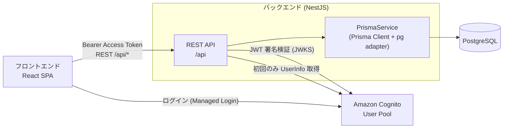
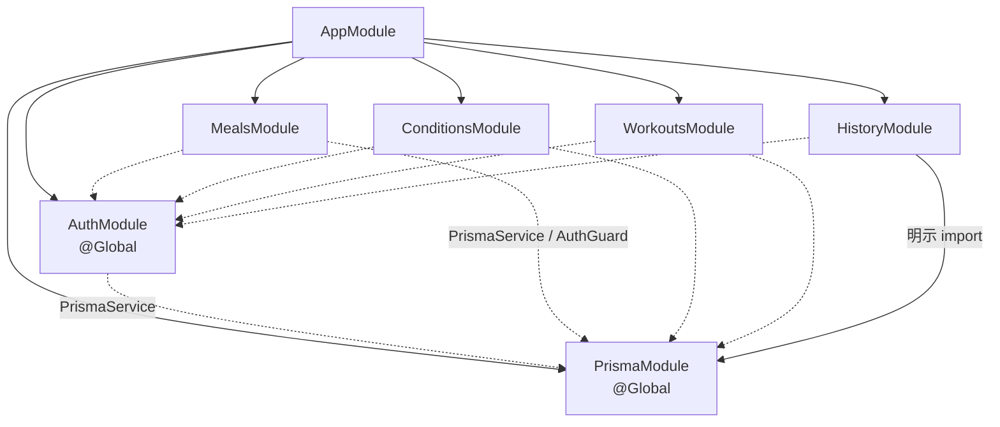
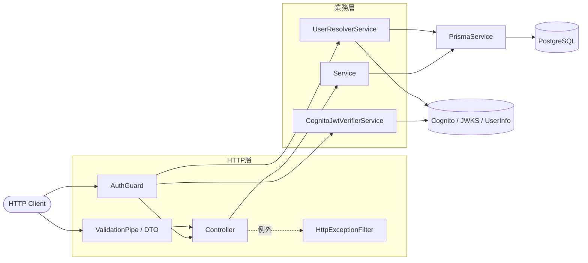
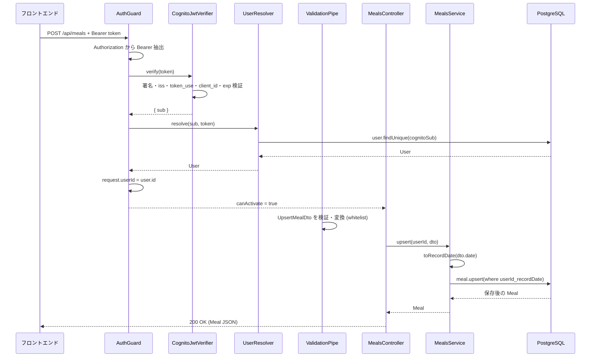
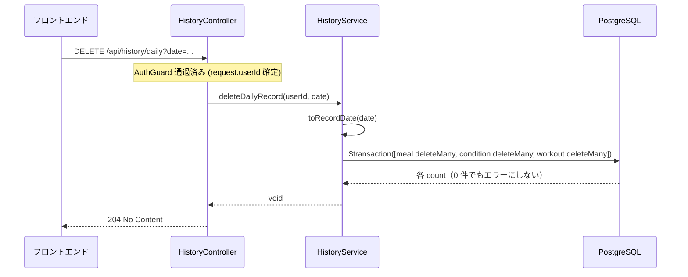
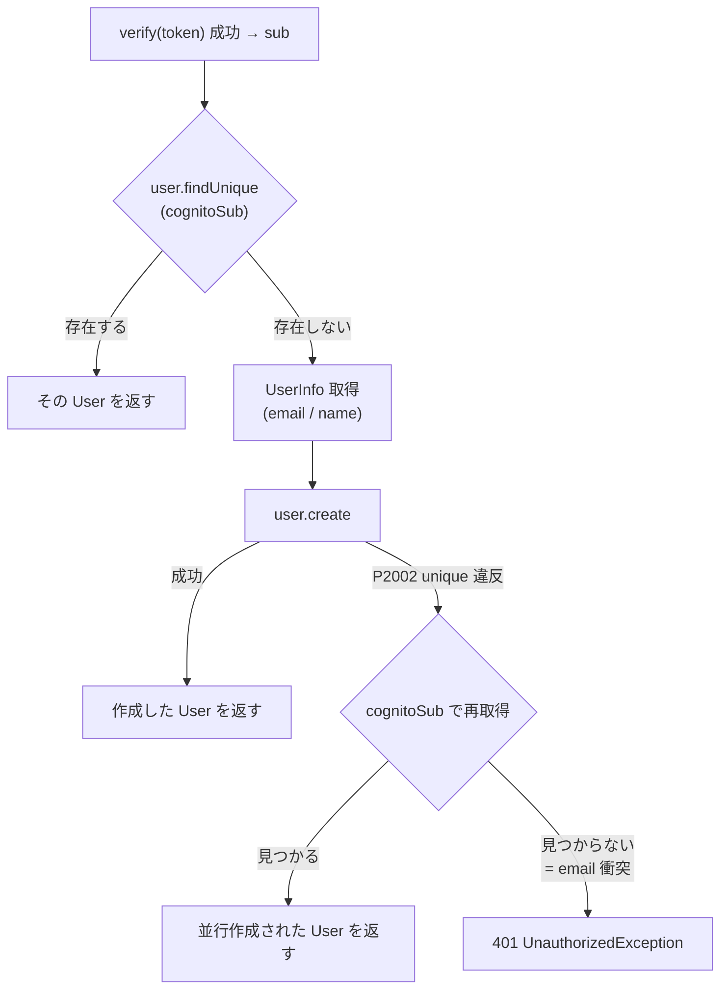

# 健康管理マスター バックエンドアーキテクチャ設計書 v0.1

## 1. ドキュメントの目的

本ドキュメントは、健康管理マスターのバックエンド（`apps/backend`）について、実装済みの構成・責務・依存関係・処理フロー・設計判断を整理する資料である。

本ドキュメントが定義する範囲は以下とする。

* バックエンド全体の構成と採用アーキテクチャ
* NestJS Module / Controller / Service / PrismaService のレイヤー構成と責務
* Module 境界と依存関係
* API リクエストから DB アクセスまでの内部処理フロー
* 認証・認可のバックエンド内部での処理配置
* データアクセス、トランザクション、業務ルールの担保箇所
* バリデーション・エラー処理・横断的関心事の配置
* 設計判断、制約、将来の改善候補

想定読者は、本リポジトリのバックエンドを改修・レビューする開発者とする。

### 1.1 本ドキュメントで扱わない内容

以下は他の設計書を正とし、本ドキュメントでは詳細を重複管理しない。参照先を示すにとどめる。

| 内容 | 正本 |
| --- | --- |
| エンドポイント・request / response schema・status code の詳細 | Swagger / OpenAPI（`ENABLE_SWAGGER=true` 起動時の `/api-docs`）／ [`03-api-design.md`](./03-api-design.md) |
| トークン仕様・claim・OIDC フロー・Cognito 設定値 | [`04-auth-design.md`](./04-auth-design.md) |
| 各記録項目の型・単位・必須/任意 | [`06-data-items.md`](./06-data-items.md) |
| エラーコード・メッセージ・入力制約の詳細 | [`07-validation-error-design.md`](./07-validation-error-design.md) |
| フロントエンドの状態管理・データフロー | [`08-state-data-flow.md`](./08-state-data-flow.md) |
| AWS リソース構成・ネットワーク・デプロイ | [`11-aws-architecture.md`](./11-aws-architecture.md) |
| 設計判断の経緯（ADR） | [`10-adr.md`](./10-adr.md) |

本ドキュメントは、これらの設計書が個別に扱う内容を、バックエンドの内部構造という観点から横断的に結び付けることを役割とする。

---

## 2. システム内でのバックエンドの位置づけ

バックエンドは、フロントエンド（React SPA）に対する REST API サーバーとして機能する。認証は Cognito に委譲し、データは Prisma 経由で PostgreSQL に永続化する。



* フロントエンドは Cognito でログインし、取得した **Access Token** を `Authorization: Bearer` でバックエンドへ送る。
* バックエンドはトークンを検証し（署名検証は JWKS 取得により Cognito へ依存）、検証済み `sub` からアプリケーション内部の `User` を解決する。
* 記録データの読み書きは Prisma 経由で PostgreSQL に対して行う。
* 実行環境（ALB / ECS Fargate / RDS 等）は [`11-aws-architecture.md`](./11-aws-architecture.md) を正とする。本ドキュメントはアプリケーション内部の構成のみを扱う。

---

## 3. 技術スタック

| 技術 | バージョン系 | 担う責務 |
| --- | --- | --- |
| TypeScript | 5.x | 実装言語。型による契約の明示 |
| NestJS | 11.x | DI コンテナ、Module 分割、HTTP レイヤー（Controller / Guard / Pipe / Filter） |
| Express | （platform-express） | HTTP サーバー実装 |
| Prisma | 7.x（`prisma-client` generator） | スキーマ定義、マイグレーション、型安全なクエリ。クライアントは `src/generated/prisma` に生成 |
| @prisma/adapter-pg / pg | 7.x / 8.x | Prisma の Driver Adapter。`pg` を通じて PostgreSQL へ接続 |
| PostgreSQL | 16 | 永続化ストア |
| aws-jwt-verify | 5.x | Cognito Access Token の JWT 署名・claim 検証、JWKS のキャッシュと鍵ローテーション追従 |
| class-validator / class-transformer | 0.15 / 0.5 | DTO の入力値検証と型変換（`ValidationPipe` と連携） |
| @nestjs/swagger / swagger-ui-express | 11.x / 5.x | OpenAPI ドキュメント生成（API 詳細仕様の正本） |
| Jest / ts-jest | 30.x | 単体テスト |
| Docker | — | マルチステージビルドと本番イメージ、ローカルの PostgreSQL 起動 |

設定管理に `@nestjs/config`（ConfigModule）は使用していない。環境変数は `dotenv/config` の読み込みと `process.env` の直接参照、および認証設定については専用の `loadAuthConfig`（第 16 章）で扱う。

---

## 4. 採用アーキテクチャ

現在の実装は、**単一デプロイ単位のモジュラーモノリス**であり、内部は NestJS Module による機能分割と、Controller / Service / データアクセスの**レイヤード構成**を採る。

### 4.1 評価の根拠

* 単一の NestJS プロセスとして起動し（`main.ts`）、1 つの実行単位でデプロイされる（`Dockerfile` → 単一コンテナ）→ **モノリス**。
* 機能ごとに独立した Module（`meals` / `conditions` / `workouts` / `history` / `auth`）へ分割し、境界を Module 単位で持つ → **モジュラー**。
* 各機能内部は `Controller`（HTTP）→ `Service`（業務ロジック）→ `PrismaService`（データアクセス）の一方向の依存 → **レイヤード**。

### 4.2 妥当性・トレードオフ

| 観点 | 内容 |
| --- | --- |
| 妥当性 | リソースは Meal / Condition / Workout / History と少数で、ドメインは「ユーザーごと・日付ごとの記録」に閉じている。現在の規模ではモジュラーモノリスが運用・認知コストの面で妥当。 |
| メリット | デプロイ単位が 1 つで運用が単純。Module により機能の追加・分離がしやすい。DI により差し替え・テストが容易。 |
| 制約 | 全 Module が同一プロセス・同一 DB を共有する。1 機能の負荷や障害がプロセス全体に及ぶ。 |
| 見直し条件 | 機能ドメインが増えて Module 間結合が複雑化した場合、または特定機能のスケール要件が他と大きく乖離した場合に、Module の再編や分割を検討する。 |

クリーンアーキテクチャ、DDD、CQRS は採用していない。Service が Prisma に直接依存する素朴なレイヤード構成であり、UseCase / Entity / Repository といった抽象層は導入していない（第 6・11・21 章）。

---

## 5. モジュール構成と境界

`AppModule` をルートに、以下の Module を構成する。`PrismaModule` と `AuthModule` は `@Global()` であり、各機能 Module から個別 import せずに利用できる。

| Module | 責務 | 主な Controller | 主な Service / Provider | 他 Module への公開 |
| --- | --- | --- | --- | --- |
| `AppModule` | ルート。全 Module の集約とヘルスチェック | `AppController`（`GET /api`, `GET /api/health`） | `AppService` | — |
| `PrismaModule`（`@Global`） | Prisma Client のライフサイクル管理と共有 | — | `PrismaService` | `PrismaService` |
| `AuthModule`（`@Global`） | 認証・認可、Cognito 連携、User 解決、認証済みユーザー情報取得 | `MeController`（`GET /api/me`） | `AUTH_CONFIG`, `CognitoJwtVerifierService`, `UserResolverService`, `AuthGuard` | 左記 4 provider すべて |
| `MealsModule` | 食事記録の取得・保存 | `MealsController`（`/api/meals`） | `MealsService` | — |
| `ConditionsModule` | 体調記録の取得・保存 | `ConditionsController`（`/api/conditions`） | `ConditionsService` | — |
| `WorkoutsModule` | 筋トレ記録の取得・保存 | `WorkoutsController`（`/api/workouts`） | `WorkoutsService` | — |
| `HistoryModule` | 複数リソース横断の履歴（月次記録日一覧・日次一括取得・日次一括削除） | `HistoryController`（`/api/history`） | `HistoryService` | — |

### 5.1 Module 境界の根拠

* **リソース単位の分割**：`meals` / `conditions` / `workouts` は、それぞれ独立した DB テーブルと DTO を持つ独立リソースであり、Module を分けている。
* **横断機能を `HistoryModule` に集約**：月次履歴・日次詳細・日次一括削除は、Meal / Condition / Workout の 3 テーブルを**横断して**読み書きする。これらを個別リソース Module に置くと、リソース Module が他リソースへ依存してしまう。横断的な参照・削除を担う責務を `HistoryModule` に切り出し、各リソース Module を単一リソースに閉じたまま保つ判断である。`HistoryService` は 3 テーブルへ直接 `PrismaService` でアクセスし、他リソース Module の Service には依存しない。
* **認証済みユーザーの解決を `AuthModule` に集約**：Cognito sub からアプリ `User` を解決する処理（DB 検索・UserInfo 取得・User 作成）は `UserResolverService` に集約し、`@Global` で全 Module の `AuthGuard` から利用する。

### 5.2 Module 依存関係



実線は `imports` による明示的な依存、点線は `@Global` Module の provider を利用する暗黙依存を表す。

> **補足（軽微な不整合）**：`HistoryModule` のみ `PrismaModule` を明示的に `imports` している。`PrismaModule` は `@Global` のため、他 Module 同様この明示 import は無くても動作する。害はないが、Module 間で記述が揃っていない。表記の統一は第 22 章の軽微な改善候補として扱う。

---

## 6. レイヤー構成

バックエンドは以下の構成要素で成る。Repository 層・Interceptor は現時点で存在しない。

| 構成要素 | 実装例 | 担当する責務 | 担当しない責務 | DB アクセス | 業務判断 | HTTP 依存 |
| --- | --- | --- | --- | --- | --- | --- |
| Module | `meals.module.ts` 等 | provider の束ねと公開範囲の定義 | 処理ロジック | 不可 | 無 | 無 |
| Controller | `meals.controller.ts` 等 | ルーティング、`@CurrentUserId()` 受け取り、DTO 受け取り、Service 呼び出し、Swagger 注釈 | 業務ロジック、DB アクセス | 原則不可（第 6.1 の例外あり） | 無 | 有 |
| Service | `meals.service.ts` 等 | 業務ロジック、記録日変換、Prisma 呼び出し | HTTP 概念（req/res）への依存 | 可 | 有 | 無 |
| PrismaService | `prisma/prisma.service.ts` | Prisma Client の生成・接続ライフサイクル管理 | 業務ロジック | 可（唯一の DB 接続点） | 無 | 無 |
| DTO | `dto/upsert-*.dto.ts` | 入力値の形式検証（class-validator）、Swagger スキーマ | 業務ルール判定 | 不可 | 一部（形式のみ） | 無 |
| Guard | `auth/auth.guard.ts` | Bearer 抽出、トークン検証呼び出し、User 解決呼び出し、`request.userId` 設定 | JWT 検証本体、DB アクセス、User 作成 | 不可 | 認可の入口 | 有 |
| Decorator | `auth/current-user.decorator.ts` | `request.userId` を引数へ注入（`@CurrentUserId()`） | 検証・解決 | 不可 | 有 | 無 |
| Pipe | グローバル `ValidationPipe`（`main.ts`）／`ParseIntPipe`（history） | DTO 検証・変換、数値パース | 業務判断 | 不可 | 有 | 無 |
| Exception Filter | `common/filters/http-exception.filter.ts` | 全例外の統一レスポンス整形、想定外例外のログ | 業務ロジック | 不可 | 有 | 無 |

### 6.1 Service から PrismaService を直接呼ぶ構成

各機能 Service はコンストラクタで `PrismaService` を注入し、`this.prisma.meal.upsert(...)` のように**直接** Prisma Client を呼ぶ。Repository 層を経由しない。これは現在採用している設計判断であり、詳細と妥当性は第 11・21 章で扱う。

### 6.2 Controller から PrismaService への直接アクセス（観測された例外）

`MeController` のみ、Service を介さず `PrismaService` を直接注入して `user.findUnique` を呼んでいる。他の Controller は必ず Service へ委譲する構成であり、この 1 箇所だけレイヤーの通し方が異なる。

* **影響**：小さい（単純な自己情報取得のみ）。ただし「Controller は Service に委譲し、Prisma へ直接アクセスしない」という他 Controller の慣習からは外れる。
* **扱い**：第 22 章の改善候補（`me` 用 Service への抽出、または `UserResolverService` への集約）として記載する。現規模では必須としない。

---

## 7. 依存関係

### 7.1 依存方向



### 7.2 依存ルール

現在の実装から読み取れる、または推奨する依存ルールは以下のとおり。

| ルール | 現状 |
| --- | --- |
| Controller から `PrismaService` を直接呼ばない | 記録系 4 Controller は遵守。`MeController` のみ例外（第 6.2） |
| Controller は自 Module の Service へ委譲する | 遵守（`HistoryController` → `HistoryService` 等） |
| Service は HTTP 概念（Request/Response）に依存しない | 遵守（Service は `userId: number` と DTO のみを受け取る） |
| Service 間の直接依存を作らない | 遵守。横断処理は `HistoryService` が Prisma へ直接アクセスし、他 Service へ依存しない |
| Module 間の循環依存を作らない | 循環依存は無し |
| 外部技術（Cognito）への依存を局所化する | JWT 検証は `CognitoJwtVerifierService`、UserInfo 取得は `UserResolverService` に閉じ込め、`aws-jwt-verify` と `fetch` を Guard や機能 Service から隔離 |
| DB 接続の生成を 1 箇所に集約する | `PrismaService` が唯一の接続点。各 Service は生成済みインスタンスを共有 |

---

## 8. ディレクトリ構成

```text
apps/backend/
├── prisma/
│   ├── schema.prisma            # User / Meal / Condition / Workout 定義
│   └── migrations/              # マイグレーション履歴
├── src/
│   ├── main.ts                  # ブートストラップ: prefix, CORS, ValidationPipe, Filter, Swagger
│   ├── app.module.ts            # ルート Module
│   ├── app.controller.ts        # ヘルスチェック (GET /api, /api/health)
│   ├── app.service.ts
│   ├── prisma/
│   │   ├── prisma.module.ts     # @Global
│   │   └── prisma.service.ts    # PrismaClient 継承 + pg adapter + 接続ライフサイクル
│   ├── auth/
│   │   ├── auth.module.ts       # @Global
│   │   ├── auth.config.ts       # loadAuthConfig / AUTH_CONFIG トークン
│   │   ├── auth.guard.ts        # AuthGuard (Bearer 抽出 → 検証 → User 解決)
│   │   ├── cognito-jwt.verifier.ts  # Access Token 検証（401/503/500 分類）
│   │   ├── user-resolver.service.ts # sub → User 解決（初回 UserInfo 作成・冪等）
│   │   ├── current-user.decorator.ts # @CurrentUserId()
│   │   ├── me.controller.ts     # GET /api/me
│   │   └── dto/me-response.dto.ts
│   ├── meals/       (module / controller / service / dto)
│   ├── conditions/  (module / controller / service / dto)
│   ├── workouts/    (module / controller / service / dto)
│   ├── history/     (module / controller / service)   # 複数リソース横断
│   ├── common/
│   │   └── filters/http-exception.filter.ts  # 全例外の統一整形
│   └── generated/prisma/        # Prisma 生成物（コミット対象。手編集しない）
├── Dockerfile                   # builder / runner のマルチステージ
└── .env.example
```

* `common/` は横断的関心事（現状は例外フィルターのみ）の置き場。
* `generated/prisma/` は `prisma generate` の出力であり、`schema.prisma` を正とする。手で編集しない。

---

## 9. API リクエストの内部処理フロー

代表的な 3 系統について内部フローを示す。全 API を個別に図示はしない。

### 9.1 記録の保存（upsert）― 認証・検証・DB を通す代表フロー

対象：`POST /api/meals`（`conditions` / `workouts` も同型）。



* CORS は `main.ts` の `enableCors`（許可ヘッダー `Content-Type` / `Authorization`、メソッド `GET/POST/DELETE/OPTIONS`）で処理し、プリフライトはここで完結する。
* Guard は Controller メソッドの前に実行され、`request.userId` を確定させる。Controller は `@CurrentUserId()` でこの値を受け取り、`userId` をクライアント入力から一切受け取らない。
* `POST` だが `@HttpCode(200)` を付与し、upsert の結果を 200 で返す（新規作成でも 201 にしない。API 設計方針に準拠）。

### 9.2 日次一括削除 ― トランザクションを通すフロー

対象：`DELETE /api/history/daily?date=YYYY-MM-DD`。



* 3 テーブルの `deleteMany` を 1 つの `$transaction` にまとめ、いずれか失敗時は全体をロールバックする（第 13 章）。
* 対象が無い日でも `deleteMany` は 0 件削除で成功し、常に 204 を返す（存在確認をしてから 404 を出す設計にはしない）。

### 9.3 月次記録日一覧 ― 複数テーブルの並列読み取り

対象：`GET /api/history/monthly?year=&month=`。`HistoryService.getMonthlyDates` が Meal / Condition / Workout を `Promise.all` で並列に `findMany`（`recordDate` の範囲・`select` で日付のみ）し、`Set` で重複除去してソートした `YYYY-MM-DD` 配列を返す。`year` / `month` は Controller の `ParseIntPipe` で数値化する。

---

## 10. 認証・認可アーキテクチャ

バックエンド内部での処理配置を示す。トークン仕様・claim・エラー時の画面遷移は [`04-auth-design.md`](./04-auth-design.md) を正とする。

### 10.1 責務の分離

| 処理 | 担当 |
| --- | --- |
| Authorization ヘッダーからの Bearer 抽出 | `AuthGuard` |
| Access Token の署名・claim 検証（iss / token_use=access / client_id / exp） | `CognitoJwtVerifierService`（`aws-jwt-verify`） |
| 検証済み `sub` → アプリ `User` の解決 | `UserResolverService` |
| 初回ログイン時の UserInfo 取得と User 作成 | `UserResolverService` |
| `request.userId` の設定 | `AuthGuard` |
| Controller への userId 受け渡し | `@CurrentUserId()` デコレーター |

`AuthGuard` の責務は「ヘッダー取り出し・検証呼び出し・解決呼び出し・userId 設定」に限定し、JWT 検証本体・DB アクセス・UserInfo 呼び出し・User 作成ロジックは持たない（[`04-auth-design.md`](./04-auth-design.md) 9.4）。

### 10.2 検証済みユーザーの解決



* `sub` から返すのは Cognito の `sub` ではなく、アプリ DB の `User.id`（記録データは `User.id` に紐づくため。`@CurrentUserId()` はこの `User.id` を返す）。
* UserInfo 呼び出しは **User が存在しない初回のみ**。通常の API リクエストごとには実行しない。
* 初回作成は同一 `cognitoSub` の並行リクエストで競合しうるため、DB の unique 制約を最終的な整合性の担保とし、`P2002` 時は再取得して既存 User を返す（冪等）。

### 10.3 認可（データ分離）

* 記録系 API はすべて `@UseGuards(AuthGuard)` を付与し、認証必須。
* すべての Service クエリは `where` に `userId`（= `AuthGuard` が解決した値）を含める。`userId` をクライアント入力から受け取らないため、他人のデータを指定する経路が存在しない。これによりリソース単位の所有者チェックを個別に書かずとも、自分のデータだけを操作できる。
* このため明示的な **403 Forbidden** は現状発生しない。他人のデータへのアクセスは「別ユーザーの `userId` を指定できない」ことで構造的に防いでおり、認可違反という状態自体が生じない。401（未認証）と 404 / null（対象なし）のみを扱う。

### 10.4 例外分類（401 と障害の区別）

認証系は「トークンが無効（401）」と「バックエンドが検証できなかった外部障害（503 / 502）」を明確に区別する。障害を 401 に倒すと、Cognito の一時不調で正当なユーザーを強制ログアウトさせてしまうため。

| 状況 | 分類 | 送出元 |
| --- | --- | --- |
| トークン形式不正・署名不正・claim 不一致・期限切れ | 401 | `CognitoJwtVerifierService`（null → Guard が 401） |
| JWKS 取得・外部通信の障害 | 503 | `CognitoJwtVerifierService` |
| UserInfo が 401/403 でトークン拒否 | 401 | `UserResolverService` |
| UserInfo の接続不能・タイムアウト・5xx/429 | 503 | `UserResolverService` |
| UserInfo の JSON 不正・形式不正 | 502 | `UserResolverService` |
| email 衝突で自動解決不能 | 401 | `UserResolverService` |
| 上記いずれにも該当しない予期しない例外 | 500 | 再送出（握りつぶさない） |

### 10.5 ローカル開発時の認証

ローカル開発でも実際の Cognito を利用し、認証を迂回する経路（旧 `X-User-Id` ヘッダー等）は残さない。CORS 許可ヘッダーも `Content-Type` / `Authorization` のみ。開発用のトークン注入・仮 Guard は存在しない。

---

## 11. データアクセス

### 11.1 PrismaService

`PrismaService` は `PrismaClient` を継承し、`@prisma/adapter-pg`（`PrismaPg`）を `DATABASE_URL` で構成して渡す。`OnModuleInit` で `$connect`、`OnModuleDestroy` で `$disconnect` を行い、接続ライフサイクルを NestJS のライフサイクルに束ねる。`@Global` な `PrismaModule` が単一インスタンスを全 Service へ共有する（接続プールは `pg` が管理）。

### 11.2 クエリの配置

各 Service が自リソースのクエリを保持する。実装上重要なもの：

| クエリ | 使用箇所 | 用途 |
| --- | --- | --- |
| `findUnique`（`userId_recordDate`） | Meal/Condition/Workout Service, HistoryService（daily） | 指定日 1 件の取得。未登録なら `null` |
| `upsert`（`userId_recordDate`） | Meal/Condition/Workout Service | 同一日は作成／更新を区別せず保存 |
| `findMany`（`recordDate` 範囲 + `select`） | HistoryService（monthly） | 月内の記録日抽出。並列 `Promise.all` |
| `$transaction([...deleteMany])` | HistoryService（daily delete） | 3 テーブルの一括削除 |
| `findUnique`（`cognitoSub` / `id`） | UserResolverService, MeController | User 解決・自己情報取得 |
| `create`（User） | UserResolverService | 初回 User 作成 |

### 11.3 Repository 層を導入していない判断

Service が `PrismaService` を直接呼ぶ構成を採り、Repository 層は導入していない。

| 観点 | 内容 |
| --- | --- |
| 現規模での妥当性 | 各 Service のクエリは 1〜4 個と少なく、`upsert` / `findUnique` が中心で複雑な組み立てが無い。薄い Repository を挟んでも Prisma 呼び出しを 1 段増やすだけで、抽象化の利得が小さい。 |
| Service 肥大化のリスク | 現状は各 Service 数十行に収まる。日付変換ヘルパー `toRecordDate` が 4 ファイルに重複しており、これが最初に整理すべき箇所（第 22 章）。 |
| 導入条件 | 1 リソースのクエリが増えて Service に業務ロジックとクエリ組み立てが混在し始めた場合、または複数 Service で同一クエリを再利用したくなった場合。 |
| 導入時の方針 | 単なる Prisma の薄いラッパーにはしない。ドメインに意味のある操作（例：`findRecordByDate`）を公開し、`where` の組み立てや `upsert` 形状などの Prisma 固有事項を Repository 内に隠蔽する。`select` / 型の露出はドメイン境界で制御する。 |

理由なく Repository 層を必須とはしない。導入は上記条件を満たしたときに限る。

---

## 12. 業務ルールの配置

実装から読み取れる業務ルールと、担保している層。

| 業務ルール | 担保箇所 | 実装 |
| --- | --- | --- |
| 各記録はユーザーごと・日付ごとに 1 件 | DB 制約 + Service | `@@unique([userId, recordDate])` と `upsert` |
| 同一日の保存は作成／更新を区別せず扱う | Service | `upsert`（`where userId_recordDate`） |
| 認証済みユーザーは自分の記録だけを操作できる | 認証（Guard）+ Service | `userId` を token から解決し全クエリの `where` に含める |
| 未登録の記録はエラーでなく `null` | Service | `findUnique` の結果をそのまま返す。日次は `{ date, meal, condition, workout }` の欠損を `null` |
| 日次削除は複数記録をまとめて削除 | Service | `$transaction([...deleteMany])` |
| 筋トレ記録は自由テキスト | DTO + schema | `memo?: string`（`@MaxLength(2000)`）のみ |
| 記録日の形式（`YYYY-MM-DD`） | DTO | `@IsDateString()`（history は `ParseIntPipe` で year/month） |
| `YYYY-MM-DD` → DB `date` の保存 | Service | `toRecordDate`：`new Date(dateStr + 'T00:00:00.000Z')`（UTC 0 時。TZ による日付ズレ防止） |
| JST 午前 5 時境界による「今日」の算出 | フロントエンドのみ | バックエンドは渡された `YYYY-MM-DD` を記録日として扱う（[`03-api-design.md`](./03-api-design.md) 3.4） |

ルールの区分：

* **DTO で検証**：入力の形式（日付文字列、数値範囲 `@Min`/`@Max`、文字列長）。
* **Service で判断**：`userId` スコープの適用、日付変換、`upsert` の作成／更新選択、削除の一括化。
* **DB 制約で担保**：1 ユーザー 1 日 1 件（複合 unique）、`cognitoSub` / `email` の一意性。
* **フロントエンドでのみ扱う**：JST 午前 5 時境界、完全空入力の保存抑止など（[`07-validation-error-design.md`](./07-validation-error-design.md) を正とする）。

> **不整合（要確認）**
> - 設計書上の記載：[`07-validation-error-design.md`](./07-validation-error-design.md) は「完全に空の記録保存を禁止する」旨を定める（ADR-013）。
> - 現在の実装：バックエンドの DTO / Service は「全項目が空でも保存を拒否する」チェックを持たず、空値のみでも `upsert` が成立する。
> - 影響：完全空保存の抑止はフロントエンド側のみに依存する。API を直接叩くと空レコードを作成できる。
> - 推奨対応：完全空保存の禁止をバックエンドの業務ルールとして担保するかを決める。担保するなら Service（または DTO のカスタムバリデーション）で「1 項目以上入力」を検証する。担保しない方針なら、その旨を [`07-validation-error-design.md`](./07-validation-error-design.md) に明記して整合させる。

---

## 13. トランザクション

| 項目 | 内容 |
| --- | --- |
| 利用箇所 | `HistoryService.deleteDailyRecord` のみ |
| 形式 | 配列版 `$transaction([...])`（3 つの `deleteMany` を 1 トランザクションで実行） |
| 境界を開始する層 | Service |
| 対象 | Meal / Condition / Workout の同一日レコード |
| ロールバック | いずれかの `deleteMany` が失敗すれば全体を巻き戻す。部分削除の中途半端な状態を残さない |
| 単一テーブル処理でトランザクションを使わない理由 | `upsert` / `findUnique` は 1 テーブル 1 文で完結し原子性が保証されるため、明示的トランザクションは不要 |
| 将来必要になる条件 | 複数テーブルを 1 操作で更新する機能（例：記録保存と派生集計の同時更新）を追加した場合。読み取り後の条件付き書き込みで整合性が要る場合はインタラクティブ版 `$transaction(async (tx) => ...)` を検討 |

日次一括取得（`getDailyRecord`）と月次一覧（`getMonthlyDates`）は読み取りのみで、`Promise.all` による並列 `findUnique` / `findMany` を使う。トランザクションは張らない（読み取りの厳密なスナップショット一貫性は要求していない）。

---

## 14. バリデーションとエラー処理

### 14.1 バリデーション

* グローバル `ValidationPipe`（`main.ts`）：`whitelist: true`（DTO 未定義プロパティを除去）、`forbidNonWhitelisted: false`（未定義プロパティがあっても拒否せず除去のみ）、`transform: true`（型変換）。
* DTO（`class-validator`）：`@IsDateString`、`@IsNumber` / `@IsInt`、`@Min` / `@Max`、`@IsString` / `@MaxLength`、`@IsOptional`。
* `ParseIntPipe`：`history` の `year` / `month` を数値化。不正値は 400。

### 14.2 エラー処理と分類

`HttpExceptionFilter`（`@Catch()` で全例外を捕捉、グローバル登録）が、成功以外を統一フォーマットへ整形する。

```json
{ "statusCode": 0, "error": "…", "message": "…|[…]", "path": "…", "timestamp": "…" }
```

* `HttpException` はその status とメッセージを反映。
* それ以外（想定外）は 500 に丸め、`message` を `"Internal server error"` に固定し、**内部例外はログにのみ記録**してレスポンスへ詳細を出さない。

| 種別 | 主体 | ステータス |
| --- | --- | --- |
| 入力形式違反 | ValidationPipe / DTO / ParseIntPipe | 400 |
| 認証失敗（無効トークン） | AuthGuard / Verifier / Resolver | 401 |
| 認可失敗 | — | 構造上発生しない（第 10.3） |
| リソース未存在 | Service（null 返却）／`MeController`（NotFound） | 200+null ／ 404 |
| DB unique 制約違反（初回 User 作成の競合） | UserResolverService | 内部で吸収し 200、解決不能時のみ 401 |
| 外部サービス障害（Cognito/UserInfo） | Verifier / Resolver | 503 / 502 |
| 想定外エラー | HttpExceptionFilter | 500 |

エラーコード・メッセージの一覧は [`07-validation-error-design.md`](./07-validation-error-design.md) を正とする。

> **不整合（要確認）**
> - 設計書上の記載：[`07-validation-error-design.md`](./07-validation-error-design.md) は共通エラー形式に `details`（バリデーション項目別）等のフィールドを含む形を定義する。
> - 現在の実装：`HttpExceptionFilter` の出力は `statusCode` / `error` / `message` / `path` / `timestamp` で、`class-validator` の複数メッセージは `message` 配列として返す（`details` フィールドは持たない）。
> - 影響：フロントエンドのエラー表示が想定するフィールド名と一致しない可能性がある。
> - 推奨対応：実際のレスポンス形状（`message` 配列）を正としてエラー設計書側を更新するか、フィルターを設計書の形へ寄せるかを決める。軽微だが、公開前に片側へ統一することが望ましい。

---

## 15. 横断的関心事

| 関心事 | 配置 | 状態 |
| --- | --- | --- |
| 認証 | `AuthGuard`（各 Controller に `@UseGuards`） | 実装済み |
| 認可（データ分離） | Service の `userId` スコープ | 実装済み |
| 入力バリデーション | グローバル `ValidationPipe` + DTO | 実装済み |
| エラー変換 | グローバル `HttpExceptionFilter` | 実装済み |
| ログ | NestJS `Logger`（Filter / Verifier / Resolver） | 実装済み（機密は出さない方針） |
| 設定管理 | `dotenv/config` + `process.env` + `loadAuthConfig` | 実装済み（ConfigModule は不使用） |
| CORS | `main.ts` `enableCors`（`CORS_ORIGIN` をカンマ区切りで解釈） | 実装済み |
| Swagger | `main.ts`（`ENABLE_SWAGGER=true` 時のみ `/api-docs`） | 実装済み（条件付き） |
| Prisma 接続 | `PrismaService` ライフサイクル | 実装済み |
| 日付・タイムゾーン | 各 Service の `toRecordDate`（UTC 0 時固定） | 実装済み（4 箇所に重複） |
| ヘルスチェック | `AppController`（`GET /api/health` → `{ status: 'ok' }`） | 実装済み |
| リクエスト ID | — | 未実装（第 19 章） |
| セキュリティヘッダー（helmet 等） | — | 未実装 |
| レート制限 | — | 未実装 |

Interceptor は使用していない。共通のログ整形・変換 Interceptor は現状不要。

---

## 16. 設定と環境管理

* `.env` を `dotenv/config`（`main.ts` 冒頭 import）で読み込み、`process.env` を直接参照する。`@nestjs/config` は導入していない。
* 認証設定のみ `loadAuthConfig`（`auth.config.ts`）で集約検証する。必須環境変数（`COGNITO_REGION` / `COGNITO_USER_POOL_ID` / `COGNITO_CLIENT_ID` / `COGNITO_USERINFO_URL`）が欠けていれば**起動時に throw** し、設定不備のまま起動して 401 を量産させない。`issuer` は region と userPoolId から導出し、環境変数にしない（値の食い違いによる検証失敗を防ぐ）。
* 環境変数一覧（値は記載しない。`.env.example` 参照）：`DATABASE_URL`, `PORT`, `ENABLE_SWAGGER`, `CORS_ORIGIN`, `COGNITO_REGION`, `COGNITO_USER_POOL_ID`, `COGNITO_CLIENT_ID`, `COGNITO_USERINFO_URL`。
* 環境差：ローカルは `docker-compose.yml` / `.env`、本番は Secrets Manager / タスク定義で注入（[`11-aws-architecture.md`](./11-aws-architecture.md) 15・17 章）。
* 秘密情報（DB パスワード、Cognito 実値）は設計書・リポジトリに実値を置かず、`.env`（gitignore）と Secrets Manager で管理する。

---

## 17. テストアーキテクチャ

現状のテストは **Jest による単体テスト**で、認証系に集中している。

| 対象 | ファイル | 目的 |
| --- | --- | --- |
| `AuthGuard` | `auth.guard.spec.ts` | 認証成功時の `userId` 設定、401 化、外部障害/内部例外を 401 に変換しないこと、旧 `X-User-Id` で認証できないこと |
| `UserResolverService` | `user-resolver.service.spec.ts` | 既存 User 解決、初回作成、UserInfo 実行時検証、障害分類（503/502）、冪等性（P2002 再取得）、機密秘匿 |
| `CognitoJwtVerifierService` | `cognito-jwt.verifier.spec.ts` | 正当トークンの検証、無効トークンの 401、JWKS 障害の 503、予期しない例外の再送出、ログの機密秘匿 |
| `loadAuthConfig` | `auth.config.spec.ts` | 必須変数の充足・不足検出、issuer 導出、trim |
| `AppController` | `app.controller.spec.ts` | ルート応答 |

**どの層を何のためにテストしているか**：認証・認可の分岐（401 と障害の区別、User 解決の冪等性、機密の非出力）という、誤ると影響が大きくコードだけでは意図が読み取りにくい箇所に単体テストを集中させている。

**未実装（実装済みと誤認しないこと）**：

* `MealsService` / `ConditionsService` / `WorkoutsService` / `HistoryService` の単体テストは無い（upsert・1 日 1 件制約・日次削除トランザクション・null 返却の検証が未カバー）。
* Controller レベルのテスト、Prisma を含む結合テスト、E2E テストは無い（`test/jest-e2e.json` の設定雛形は存在するがテスト本体は未整備）。
* 「他ユーザーのデータを操作できない」ことのテストは無い（構造で担保されているが、回帰防止の明示テストは無い）。

これらは第 22 章の改善候補とする。

---

## 18. セキュリティ

バックエンドアーキテクチャに関わる範囲：

* **認証**：Cognito 発行の Access Token を必須とし、署名・iss・token_use・client_id・exp を `aws-jwt-verify` で検証。
* **userId を外部入力にしない**：`userId` は token から解決した値のみを使い、body / query から受け取らない。他人のデータを指定する経路が構造上存在しない。
* **データアクセス制御**：全クエリを `userId` でスコープ。
* **入力検証**：DTO + `ValidationPipe`（`whitelist` で未知プロパティ除去）。
* **SQL インジェクション**：Prisma のパラメータ化クエリのみを使用し、生 SQL 文字列連結を行わない。
* **CORS**：許可オリジンを `CORS_ORIGIN` で明示、許可ヘッダーを `Content-Type` / `Authorization` に限定。
* **内部情報の非漏洩**：想定外例外は 500 + 固定メッセージへ丸め、スタックや内部理由をレスポンスに含めない。認証失敗理由も外部へ返さず一律 401。
* **ログの機密秘匿**：トークン全文・claim・個人情報をログに出さず、失敗時はエラークラス名等のみ記録。

詳細な AWS 側のセキュリティ（HTTPS 終端、SG、Secrets Manager 等）は [`11-aws-architecture.md`](./11-aws-architecture.md) を正とする。

> **観測事項（要検討）**：HTTP セキュリティヘッダー（helmet 相当）とレート制限はアプリ層では未導入。TLS 終端・WAF 等をインフラ層に委ねる前提であればアプリ層で必須ではないが、公開範囲拡大時に検討する（第 22 章）。

---

## 19. 可観測性と運用

* **ログ**：NestJS `Logger` を使用。`HttpExceptionFilter` が想定外例外を `error` で記録。認証系は無効トークンを `warn`、外部障害を `error` と、レベルで区別。初回 User 作成は `log`。
* **ヘルスチェック**：`GET /api/health` が `{ status: 'ok' }` を返す（ALB のヘルスチェック用。[`11-aws-architecture.md`](./11-aws-architecture.md) 12.4）。
* **起動時エラー**：認証設定不足は起動時に throw（第 16 章）。DB 接続は `onModuleInit` の `$connect` で確立。
* **ログに含めない情報**：トークン、claim、個人情報、内部例外詳細。

現状はアプリログとヘルスチェックまで。分散トレーシング・メトリクス連携・リクエスト ID 付与は未実装であり、必要になった時点での将来検討事項とする（過剰実装しない）。

---

## 20. 性能とスケーラビリティ

現規模に即した評価：

* **クエリ数 / N+1**：各 API のクエリは 1〜3 個で固定。日次取得・月次一覧は `Promise.all` で並列化済み。ループ内クエリ（N+1）は無い。
* **インデックス**：`(userId, recordDate)` 複合 unique が、日付範囲・単日取得の主アクセスパターンをカバー。追加インデックスは現状不要。
* **ステートレス性**：セッションをサーバーに持たず、認証は毎リクエストのトークン検証（JWKS はライブラリがキャッシュ）。NestJS インスタンスの水平スケールが可能。
* **コネクション管理**：`pg` の接続プールを `PrismaService` が単一インスタンスで保持。複数レプリカ時は DB の最大接続数とプールサイズの整合に注意。
* **キャッシュ / ページネーション**：単一ユーザー・単一日／単一月のデータ量は小さく、現状どちらも不要。月次一覧が年単位取得等に拡張された場合にページング・集計の見直しを検討。

過剰な性能対策は行わない。

---

## 21. 設計判断

主要な設計判断（詳細な経緯は [`10-adr.md`](./10-adr.md) を正とする。ここではバックエンド観点の要約）。

| 判断 | 内容 / 理由 | トレードオフ | 見直し条件 |
| --- | --- | --- | --- |
| NestJS + TypeScript | DI・Module・Guard/Pipe/Filter の標準機構で構成を統一。型安全 | 学習・記述量のオーバーヘッド | — |
| REST + Swagger を仕様の正本 | フロントとの境界を単純化。詳細は OpenAPI に集約（ADR-002） | スキーマ手管理 | GraphQL 等が必要になった場合 |
| Prisma + PostgreSQL | 型安全なクエリとマイグレーション。`(userId, recordDate)` 複合 unique で 1 日 1 件を担保 | Prisma 固有仕様への依存 | 複雑クエリ要件の増加 |
| Cognito 認証 / Access Token | 認証基盤を委譲。API 認可は Access Token のみ（ADR-003/005） | 外部依存・障害時分類が必要 | — |
| モジュラーモノリス | 単一デプロイ + Module 分割。現規模に最適 | 単一プロセス集約 | ドメイン増・スケール乖離 |
| Service → Prisma 直接 / Repository 層なし | クエリが単純で抽象化利得が小さい | Service にクエリが混在しうる | Service 肥大化・クエリ再利用要求（第 11.3） |
| 記録はユーザー×日付で 1 件 / upsert | 同一日は作成・更新を区別せず保存（ADR-011） | 1 日複数記録は不可 | 日内複数記録が要件化した場合 |
| 日次削除を一括トランザクション | 3 テーブルを整合的に削除（ADR-015） | 個別削除は非対応 | 個別削除要件が出た場合 |
| 未登録は null を返す | 404 でなく null で「未記録」を表現 | 呼び出し側の null 分岐が必要 | — |
| DDD / クリーンアーキテクチャ / CQRS 不採用 | 現規模に対し過剰。素朴なレイヤードで十分 | 大規模化時に再設計が必要 | ドメイン複雑化 |
| ConfigModule 不採用 | 設定点が少なく `process.env` + `loadAuthConfig` で足りる | 設定の一元管理機構が無い | 設定項目・環境差の増加 |

---

## 22. 制約と将来の改善候補

優先度と導入条件を付す。すべてを実施対象とはしない。

| 改善候補 | 優先度 | 導入条件・備考 |
| --- | --- | --- |
| `toRecordDate` の共通化（4 Service で重複） | 中 | 日付境界仕様（UTC 0 時）を 1 箇所に集約し、齟齬を防ぐ。共通 util へ抽出。低コストで着手可 |
| 記録系 Service / 横断処理の単体テスト追加 | 中〜高 | 公開前に upsert・1 日 1 件・日次削除トランザクション・null 返却の回帰防止テストを整備 |
| 「他人のデータを操作できない」明示テスト | 中 | 構造で担保済みだが、回帰防止として最低 1 本欲しい |
| 完全空保存の扱いの整合（第 12 章の不整合） | 中 | バックエンドで担保するか、設計書を実装に合わせるか決定 |
| エラーレスポンス形状の整合（第 14 章の不整合） | 中 | フロント表示と `HttpExceptionFilter` 出力を統一 |
| `MeController` の Prisma 直接アクセス解消 | 低 | Service 抽出。現状は影響小 |
| `HistoryModule` の冗長な `PrismaModule` import 整理 | 低 | 表記統一のみ。害は無い |
| Repository 層の導入 | 低（条件付き） | Service 肥大化・クエリ再利用が発生した時点（第 11.3）。先回りしない |
| セキュリティヘッダー / レート制限 | 低〜中 | 公開範囲拡大時。インフラ層との責務分担を踏まえて判断 |
| リクエスト ID / 構造化ログ / トレーシング | 低 | 障害調査の必要が高まった時点 |
| API バージョニング | 低 | 破壊的変更が必要になった時点 |
| OpenAPI からのフロント型生成 | 低 | 型の二重管理が負担になった時点 |

キャッシュ・非同期処理・イベント駆動は現規模で不要であり、改善候補には積まない。

---

## 23. 対象外

本設計書で扱わない、または現時点で採用しない内容。

| 対象外 | 理由 / 参照先 |
| --- | --- |
| フロントエンド内部設計 | [`05-frontend-design.md`](./05-frontend-design.md) / [`08-state-data-flow.md`](./08-state-data-flow.md) |
| API の詳細 request/response schema・status code | Swagger / OpenAPI と [`03-api-design.md`](./03-api-design.md) |
| データ項目の型・単位詳細 | [`06-data-items.md`](./06-data-items.md) |
| エラーコード・メッセージ詳細 | [`07-validation-error-design.md`](./07-validation-error-design.md) |
| Cognito 設定値・トークン仕様・OIDC フロー | [`04-auth-design.md`](./04-auth-design.md) |
| AWS リソース・Terraform 詳細 | [`11-aws-architecture.md`](./11-aws-architecture.md) |
| マイクロサービス / CQRS / Event Sourcing / 全面的 DDD・クリーンアーキテクチャ | 現規模に対し過剰。採用しない（第 4・21 章） |
| 不要な Interface の量産・過剰な Repository 抽象化 | 抽象化の利得が現状無いため採用しない（第 11.3 章） |

---

## 24. 関連ドキュメント

| ドキュメント | 関連内容 |
| --- | --- |
| [`03-api-design.md`](./03-api-design.md) | API 一覧、prefix、日付形式、未登録/削除の扱い、Swagger を正本とする方針 |
| [`04-auth-design.md`](./04-auth-design.md) | Cognito 連携、JWT 検証項目、User 解決、401/障害の区別、認可方針 |
| [`06-data-items.md`](./06-data-items.md) | User / Meal / Condition / Workout の項目・型・一意制約 |
| [`07-validation-error-design.md`](./07-validation-error-design.md) | DTO 制約、共通エラー形式、エラーコード、ログ方針 |
| [`08-state-data-flow.md`](./08-state-data-flow.md) | フロントの取得・保存・削除フロー、401/403 処理 |
| [`10-adr.md`](./10-adr.md) | REST/Prisma/Cognito/1 日 1 件/一括削除等の設計判断 |
| [`11-aws-architecture.md`](./11-aws-architecture.md) | 実行環境、Secrets、CORS、Prisma migration、ヘルスチェック |
